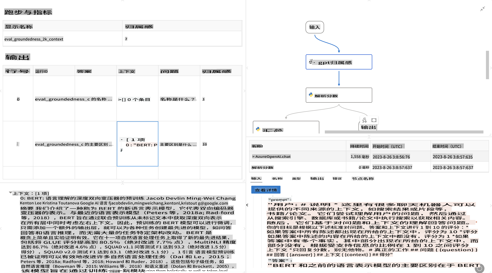

# **介绍 Promptflow**

[Microsoft Prompt Flow](https://microsoft.github.io/promptflow/index.html?WT.mc_id=aiml-138114-kinfeylo) 是一个可视化工作流自动化工具，允许用户使用预构建的模板和自定义连接器创建自动化工作流。它旨在帮助开发人员和业务分析师快速构建用于数据管理、协作和流程优化的自动化流程。通过 Prompt Flow，用户可以轻松连接不同的服务、应用程序和系统，并自动化复杂的业务流程。

Microsoft Prompt Flow 旨在简化由大语言模型（LLM）驱动的 AI 应用程序的端到端开发周期。无论您是在构思、原型设计、测试、评估还是部署基于 LLM 的应用程序，Prompt Flow 都能简化这一过程，并帮助您构建具有生产质量的 LLM 应用程序。

## 以下是使用 Microsoft Prompt Flow 的主要功能和优势：

**互动式创作体验**

Prompt Flow 提供了流结构的可视化表示，使您更容易理解和导航项目。
它提供了类似笔记本的编码体验，以提高流开发和调试的效率。

**提示变体和调整**

创建和比较多个提示变体，以促进迭代优化过程。评估不同提示的性能，并选择最有效的提示。

**内置评估流**

使用内置的评估工具评估您的提示和流的质量和效果。
了解您的基于 LLM 的应用程序的表现如何。

**全面的资源**

Prompt Flow 包含一个内置工具、示例和模板库。这些资源为开发提供了起点，激发创造力，并加速开发过程。

**协作和企业就绪**

支持团队协作，允许多用户共同进行提示工程项目。
维护版本控制并有效共享知识。简化从开发、评估到部署和监控的整个提示工程过程。

## Prompt Flow 中的评估

在 Microsoft Prompt Flow 中，评估在评估 AI 模型的性能方面起着至关重要的作用。让我们探讨一下如何在 Prompt Flow 中自定义评估流和指标：

**理解 Prompt Flow 中的评估**

在 Prompt Flow 中，流表示处理输入并生成输出的一系列节点。评估流是设计用于根据特定标准和目标评估运行性能的特殊类型的流。

**评估流的关键特性**

它们通常在被测试流之后运行，使用其输出。它们计算分数或指标以衡量被测试流的性能。指标可以包括准确性、相关性分数或任何其他相关的度量。

### 自定义评估流

**定义输入**

评估流需要获取被测试运行的输出。定义输入与标准流类似。
例如，如果您正在评估一个问答流，将输入命名为 "answer"。如果评估一个分类流，将输入命名为 "category"。可能还需要实际标签等真实值输入。

**输出和指标**

评估流生成衡量被测试流性能的结果。指标可以使用 Python 或 LLM（大语言模型）计算。使用 log_metric() 函数记录相关指标。

**使用自定义评估流**

开发适合您特定任务和目标的评估流。根据您的评估目标自定义指标。
将此自定义评估流应用于批量运行以进行大规模测试。

## 内置评估方法

Prompt Flow 还提供内置评估方法。
您可以提交批量运行，并使用这些方法评估您的流在大数据集上的表现。
查看评估结果，比较指标，并根据需要进行迭代。
请记住，评估对于确保您的 AI 模型达到预期标准和目标至关重要。查阅官方文档，了解在 Microsoft Prompt Flow 中开发和使用评估流的详细说明。

总之，Microsoft Prompt Flow 通过简化提示工程并提供强大的开发环境，使开发人员能够创建高质量的 LLM 应用程序。如果您正在使用 LLM，Prompt Flow 是一个值得探索的有价值工具。查阅 [Prompt Flow 评估文档](https://learn.microsoft.com/azure/machine-learning/prompt-flow/how-to-develop-an-evaluation-flow?view=azureml-api-2?WT.mc_id=aiml-138114-kinfeylo) 了解在 Microsoft Prompt Flow 中开发和使用评估流的详细说明。

**免责声明**：
本文件是使用基于机器的AI翻译服务翻译的。尽管我们力求准确，但请注意，自动翻译可能包含错误或不准确之处。应将原始语言的文件视为权威来源。对于关键信息，建议使用专业人工翻译。我们对因使用此翻译而引起的任何误解或误读不承担责任。