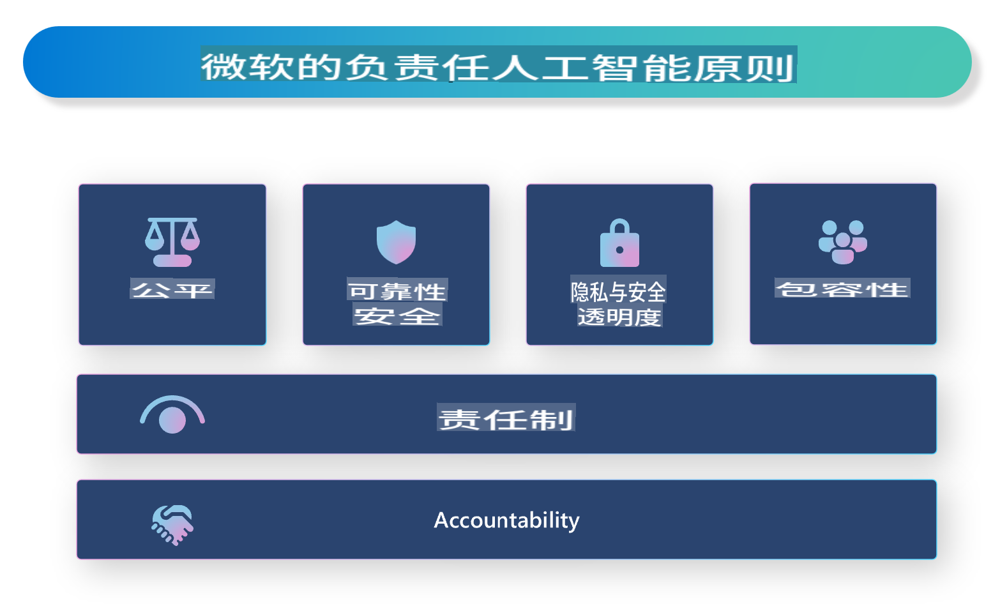

# **介绍负责任的人工智能**

[Microsoft Responsible AI](https://www.microsoft.com/ai/responsible-ai?WT.mc_id=aiml-138114-kinfeylo) 是一个旨在帮助开发者和组织构建透明、可信和负责任的人工智能系统的倡议。该倡议提供了开发符合隐私、公平和透明等伦理原则的负责任AI解决方案的指导和资源。我们还将探讨构建负责任AI系统的一些挑战和最佳实践。

## Microsoft Responsible AI 概述

**伦理原则**

Microsoft Responsible AI 以一系列伦理原则为指导，如隐私、公平、透明、问责和安全。这些原则旨在确保AI系统以伦理和负责任的方式开发。

**透明的AI**

Microsoft Responsible AI 强调AI系统中的透明性。这包括提供关于AI模型如何工作的清晰解释，以及确保数据源和算法公开可用。

**问责的AI**

[Microsoft Responsible AI](https://www.microsoft.com/ai/responsible-ai?WT.mc_id=aiml-138114-kinfeylo) 促进开发能够提供AI模型决策过程洞察的问责AI系统。这有助于用户理解和信任AI系统的输出。

**包容性**

AI系统应设计为惠及所有人。Microsoft 旨在创建考虑多样化视角并避免偏见或歧视的包容性AI。

**可靠性和安全性**

确保AI系统的可靠性和安全性至关重要。Microsoft 专注于构建一致执行且避免有害结果的强大模型。

**AI中的公平性**

Microsoft Responsible AI 认识到如果AI系统在有偏见的数据或算法上训练，可能会延续这些偏见。该倡议提供了开发不基于种族、性别或年龄等因素进行歧视的公平AI系统的指导。

**隐私和安全**

Microsoft Responsible AI 强调在AI系统中保护用户隐私和数据安全的重要性。这包括实施强大的数据加密和访问控制，并定期审计AI系统的漏洞。

**问责和责任**

Microsoft Responsible AI 促进AI开发和部署中的问责和责任。这包括确保开发者和组织意识到AI系统的潜在风险，并采取措施减轻这些风险。

## 构建负责任AI系统的最佳实践

**使用多样化的数据集开发AI模型**

为了避免AI系统中的偏见，重要的是使用代表多种观点和经验的多样化数据集。

**使用可解释的AI技术**

可解释的AI技术可以帮助用户理解AI模型如何做出决策，从而增加对系统的信任。

**定期审计AI系统的漏洞**

定期审计AI系统可以帮助识别需要解决的潜在风险和漏洞。

**实施强大的数据加密和访问控制**

数据加密和访问控制可以帮助保护AI系统中的用户隐私和安全。

**在AI开发中遵循伦理原则**

遵循公平、透明和问责等伦理原则，可以帮助建立对AI系统的信任，并确保其以负责任的方式开发。

## 使用AI Studio构建负责任的AI

[Azure AI Studio](https://ai.azure.com?WT.mc_id=aiml-138114-kinfeylo) 是一个强大的平台，允许开发者和组织快速创建智能、前沿、市场就绪和负责任的应用程序。以下是Azure AI Studio的一些关键功能和能力：

**开箱即用的API和模型**

Azure AI Studio 提供预构建和可定制的API和模型。这些涵盖了广泛的AI任务，包括生成式AI、自然语言处理、搜索、监控、翻译、语音、视觉和决策。

**Prompt Flow**

Azure AI Studio中的Prompt Flow 使您能够创建对话式AI体验。它允许您设计和管理对话流程，使构建聊天机器人、虚拟助手和其他互动应用程序变得更容易。

**检索增强生成 (RAG)**

RAG是一种结合基于检索和生成方法的技术。它通过利用预先存在的知识（检索）和创造性生成（生成）来提高生成响应的质量。

**生成式AI的评估和监控指标**

Azure AI Studio 提供评估和监控生成式AI模型的工具。您可以评估其性能、公平性和其他重要指标，以确保负责任的部署。此外，如果您创建了仪表板，您可以使用Azure Machine Learning Studio中的无代码UI来定制和生成基于[Responsible AI Toolbox](https://responsibleaitoolbox.ai/?WT.mc_id=aiml-138114-kinfeylo) Python库的负责任AI仪表板和相关评分卡。该评分卡可以帮助您与技术和非技术利益相关者分享有关公平性、特征重要性和其他负责任部署考虑的关键见解。

要使用AI Studio构建负责任的AI，您可以遵循以下最佳实践：

**定义您的AI系统的问题和目标**

在开始开发过程之前，明确定义您的AI系统要解决的问题或目标。这将帮助您识别构建有效模型所需的数据、算法和资源。

**收集和预处理相关数据**

用于训练AI系统的数据的质量和数量会显著影响其性能。因此，重要的是收集相关数据，清洗它，预处理它，并确保它代表您试图解决的人群或问题。

**选择适当的评估算法**

有各种评估算法可用。根据您的数据和问题选择最适合的算法非常重要。

**评估和解释模型**

一旦构建了AI模型，使用适当的指标评估其性能，并以透明的方式解释结果。这将帮助您识别模型中的任何偏见或限制，并在必要时进行改进。

**确保透明性和可解释性**

AI系统应是透明和可解释的，以便用户理解它们如何工作以及如何做出决策。这对于对人类生活有重大影响的应用程序尤为重要，如医疗保健、金融和法律系统。

**监控和更新模型**

AI系统应持续监控和更新，以确保它们随时间保持准确和有效。这需要对模型进行持续的维护、测试和重新训练。

总之，Microsoft Responsible AI 是一个旨在帮助开发者和组织构建透明、可信和负责任的AI系统的倡议。请记住，负责任的AI实施至关重要，而Azure AI Studio 旨在使其对组织来说切实可行。通过遵循伦理原则和最佳实践，我们可以确保AI系统以负责任的方式开发和部署，惠及整个社会。

免责声明：本翻译由AI模型从原文翻译而来，可能不够完美。请审阅输出并进行必要的修改。