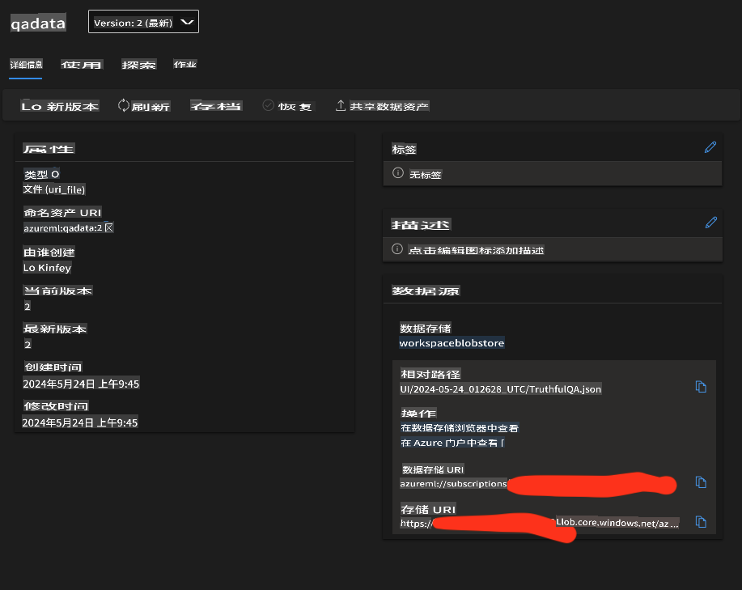

# **准备您的行业数据**

我们希望将 Phi-3-mini 注入到 [TruthfulQA 的数据](https://github.com/sylinrl/TruthfulQA/blob/main/TruthfulQA.csv) 中。第一步是导入 TruthfulQA 的数据。

### **1. 将数据加载到 csv 并保存为 json**

```python

import csv
import json

csvfile = open('./datasets/TruthfulQA.csv', 'r')
jsonfile = open('./output/TruthfulQA.json', 'w')

fieldnames = ("Type","Category","Question","Best Answer","Correct Answers","Incorrect Answers","Source")

reader = csv.DictReader(csvfile, fieldnames)

for row in reader:
    json.dump(row, jsonfile)
    jsonfile.write('\n')

i = 1
data = []
with open('./output/TruthfulQA.json', 'r') as file:
    for line in file:
        print(line)
        data.append(json.loads(line))
        print(str(i))
        i+=1


```

### **2. 将数据上传到 Azure ML 数据存储**



### **恭喜！**

您的数据已成功加载。接下来，您需要通过 Microsoft Olive 配置您的数据和相关算法 [E2E_LoRA&QLoRA_Config_With_Olive.md](./E2E_LoRA&QLoRA_Config_With_Olive.md)

**免责声明**:
本文档已使用基于机器的AI翻译服务进行翻译。尽管我们努力确保准确性，但请注意，自动翻译可能包含错误或不准确之处。应将原始文档的母语版本视为权威来源。对于关键信息，建议进行专业的人类翻译。对于因使用本翻译而引起的任何误解或误读，我们概不负责。