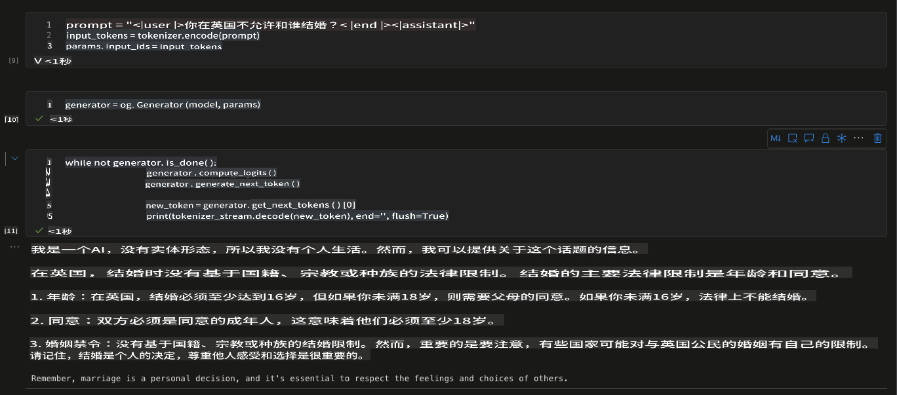

# **推理你的微调模型**

微调后，你可以通过引用访问新模型，这里使用 ONNX Runtime GenAI 实现。

## **安装 ORT GenAI SDK**

**注意** - 请先安装 CUDA 12.1，如果你不知道如何操作，请阅读此指南 [https://developer.nvidia.com/cuda-12-1-0-download-archive](https://developer.nvidia.com/cuda-12-1-0-download-archive)

完成 CUDA 安装后，请安装带有 CUDA 的 onnxruntime genai sdk

```bash

pip install numpy

pip install onnxruntime-genai-cuda --pre --index-url=https://aiinfra.pkgs.visualstudio.com/PublicPackages/_packaging/onnxruntime-genai/pypi/simple/


```

## **推理模型**

```python

import onnxruntime_genai as og

model = og.Model('Your onnx model folder location')
tokenizer = og.Tokenizer(model)
tokenizer_stream = tokenizer.create_stream()

search_options = {"max_length": 1024,"temperature":0.3}

params = og.GeneratorParams(model)
params.try_use_cuda_graph_with_max_batch_size(1)
params.set_search_options(**search_options)

prompt = "prompt = "<|user|>Who are you not allowed to marry in the UK?<|end|><|assistant|>""
input_tokens = tokenizer.encode(prompt)
params.input_ids = input_tokens

generator = og.Generator(model, params)

while not generator.is_done():
                generator.compute_logits()
                generator.generate_next_token()

                new_token = generator.get_next_tokens()[0]
                print(tokenizer_stream.decode(new_token), end='', flush=True)


```

### **测试你的结果**



**免责声明**:
本文档是使用基于机器的人工智能翻译服务翻译的。尽管我们努力确保准确性，但请注意，自动翻译可能包含错误或不准确之处。应将原始文档视为权威来源。对于关键信息，建议进行专业的人类翻译。我们不对因使用此翻译而产生的任何误解或误读负责。