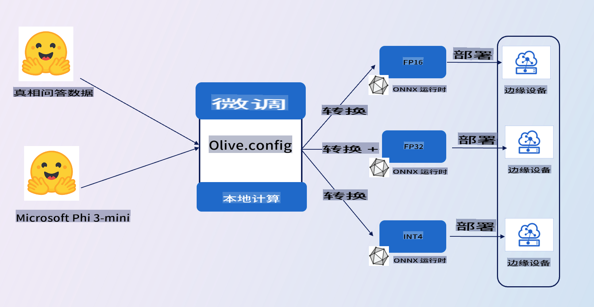

# **介绍 E2E 示例**

这个示例是导入 [TruthfulQA 的数据](https://github.com/sylinrl/TruthfulQA/blob/main/TruthfulQA.csv) 来微调 Phi-3-mini 模型。以下是架构图

## **介绍**

我们希望使用 [TruthfulQA 的数据](https://github.com/sylinrl/TruthfulQA/blob/main/TruthfulQA.csv) 集，让 Phi-3-mini 更专业地回答我们的问题。这是你第一次使用 Phi-3-mini 的 E2E 项目

### **需求**

1. Python 3.10+
2. CUDA 12.1
3. Linux / WSL
4. Azure ML
5. Azure Compute A100

### **知识点**

1. [了解 Phi-3](../01.Introduce/Phi3Family.md)
2. [了解如何使用 Microsoft Olive 进行微调](../04.Fine-tuning/FineTuning_MicrosoftOlive.md)
3. [了解 ONNX Runtime 在生成式 AI 中的应用](https://github.com/microsoft/onnxruntime-genai)

免责声明：此翻译由AI模型从原文翻译而来，可能并不完美。请审阅输出内容并进行必要的修正。