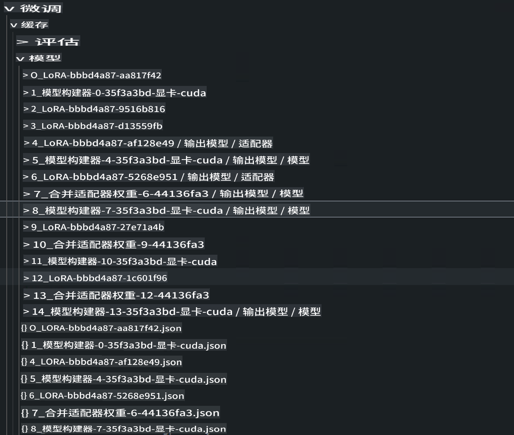

# **使用 Microsoft Olive 构建您的项目**

如果企业希望拥有自己的行业垂直模型，需要从数据、微调和部署开始。在之前的内容中，我们介绍了 Microsoft Olive 的内容，现在我们基于 E2E 的工作完成一个更详细的介绍。

## **架构**

我们可以参考 AI Toolkit for VS Code 生成的项目来构建我们的项目，包括数据、模型、微调格式和推理。比如

```txt

｜-- Your Phi-3-mini E2E Proj
    ｜-- datasets
    ｜-- fine-tuning
    ｜-- inferences
    ｜-- model-cache
    ｜-- gen-model
    ｜-- setup
     
```

- **datasets**

    数据可以存储为 csv、json 等格式。在这个例子中，是导出的 json 数据。[dataset](./E2E_Datasets.md) 

    ***Note*** 由于数据已经上传到 Azure ML（如果是本地数据可以在这里上传），我们可以忽略相关设置。

- **fine-tuning**
    
    指定微调 QLoRA 和 LoRA 算法，以及相关参数。

- **inferences**

    推理是微调后的模型。可以是微调后的 Adapter 层引用，微调后与 Adapter 集成的模型引用，或者是量化的 ONNX Runtime 模型。

- **model-cache**

    通过 Hugging face CLI 下载的模型，这里是 Phi-3-Mini 模型（使用 Azure ML 我们可以忽略这个内容，如果你想在本地操作，请执行以下脚本获取 phi-3 模型）

```bash

huggingface-cli login

# 输入你从 Hugging Face Portal 获取的密钥

huggingface-cli download microsoft/Phi-3-mini-4k-instruct --local-dir Your Phi-3-mini location

```

- **gen-model**

操作后保存的模型，包括微调后的 Adapter 模型、集成微调后的 Adapter 模型以及由 ONNX Runtime 运行的量化模型。

- **setup**

所需的安装环境，请运行此命令来设置您的 Olive 环境

```bash

pip install -r requirements.txt

```

## **Microsoft Olive 配置**

如果你想了解 Microsoft Olive 的配置，请访问 [Fine Tuning with Microsoft Olive](../04.Fine-tuning/FineTuning_MicrosoftOlive.md)

***Note*** 为了保持最新，使用以下命令安装 Microsoft Olive

```bash

pip install git+https://github.com/microsoft/Olive

```

## **在 Azure ML 中运行 Microsoft Olive**

**LoRA**

这个示例使用云计算，云数据集，在微调文件夹中添加 olive.config

```json

{
    "azureml_client": {
        "subscription_id": "Your Azure Subscription ID",
        "resource_group": "Your Azure Resource Group",
        "workspace_name": "Your Azure ML Worksapce",
        "keyvault_name":  "Your Azure Key Valuts"
    },
    "input_model":{
        "type": "PyTorchModel",
        "config": {
            "hf_config": {
                "model_name": "microsoft/Phi-3-mini-4k-instruct",
                "task": "text-generation",
                "from_pretrained_args": {
                    "trust_remote_code": true
                }
            }
        }
    },
    "systems": {
        "aml": {
            "type": "AzureML",
            "config": {
                "accelerators": [
                    {
                        "device": "gpu",
                        "execution_providers": [
                            "CUDAExecutionProvider"
                        ]
                    }
                ],
                "hf_token": true,
                "aml_compute": "Your Azure ML Compute Cluster",
                "aml_docker_config": {
                    "base_image": "mcr.microsoft.com/azureml/openmpi4.1.0-cuda11.8-cudnn8-ubuntu22.04",
                    "conda_file_path": "conda.yaml"
                }
            }
        },
        "azure_arc": {
            "type": "AzureML",
            "config": {
                "accelerators": [
                    {
                        "device": "gpu",
                        "execution_providers": [
                            "CUDAExecutionProvider"
                        ]
                    }
                ],
                "aml_compute": "Your Azure ML Compute",
                "aml_docker_config": {
                    "base_image": "mcr.microsoft.com/azureml/openmpi4.1.0-cuda11.8-cudnn8-ubuntu22.04",
                    "conda_file_path": "conda.yaml"
                }
            }
        }
    },
    "data_configs": [
        {
            "name": "dataset_default_train",
            "type": "HuggingfaceContainer",
            "load_dataset_config": {
                "params": {
                    "data_name": "json", 
                    "data_files": {
                        "type": "azureml_datastore",
                        "config": {
                            "azureml_client": {
                                "subscription_id": "Your Azure Subscrition ID",
                                "resource_group": "Your Azure Resource Group",
                                "workspace_name": "Your Azure ML Workspaces name"
                            },
                            "datastore_name": "workspaceblobstore",
                            "relative_path": "Your train_data.json Azure ML Location"
                        }
                    },
                    "split": "train"
                }
            },
            "pre_process_data_config": {
                "params": {
                    "dataset_type": "corpus",
                    "text_cols": [
                            "Question",
                            "Best Answer"
                    ],
                    "text_template": "<|user|>\n{Question}<|end|>\n<|assistant|>\n{Best Answer}\n<|end|>",
                    "corpus_strategy": "join",
                    "source_max_len": 2048,
                    "pad_to_max_len": false,
                    "use_attention_mask": false
                }
            }
        }
    ],
    "passes": {
        "lora": {
            "type": "LoRA",
            "config": {
                "target_modules": [
                    "o_proj",
                    "qkv_proj"
                ],
                "double_quant": true,
                "lora_r": 64,
                "lora_alpha": 64,
                "lora_dropout": 0.1,
                "train_data_config": "dataset_default_train",
                "eval_dataset_size": 0.1,
                "training_args": {
                    "seed": 0,
                    "data_seed": 42,
                    "per_device_train_batch_size": 1,
                    "per_device_eval_batch_size": 1,
                    "gradient_accumulation_steps": 4,
                    "gradient_checkpointing": false,
                    "learning_rate": 0.0001,
                    "num_train_epochs": 1000,
                    "max_steps": 100,
                    "logging_steps": 100,
                    "evaluation_strategy": "steps",
                    "eval_steps": 187,
                    "group_by_length": true,
                    "adam_beta2": 0.999,
                    "max_grad_norm": 0.3
                }
            }
        },
        "merge_adapter_weights": {
            "type": "MergeAdapterWeights"
        },
        "builder": {
            "type": "ModelBuilder",
            "config": {
                "precision": "int4"
            }
        }
    },
    "engine": {
        "log_severity_level": 0,
        "host": "aml",
        "target": "aml",
        "search_strategy": false,
        "cache_dir": "cache",
        "output_dir" : "../model-cache/models/phi3-finetuned"
    }
}

```

**QLoRA**

```json

{
    "azureml_client": {
        "subscription_id": "Your Azure Subscription ID",
        "resource_group": "Your Azure Resource Group",
        "workspace_name": "Your Azure ML Worksapce",
        "keyvault_name":  "Your Azure Key Valuts"
    },
    "input_model":{
        "type": "PyTorchModel",
        "config": {
            "hf_config": {
                "model_name": "microsoft/Phi-3-mini-4k-instruct",
                "task": "text-generation",
                "from_pretrained_args": {
                    "trust_remote_code": true
                }
            }
        }
    },
    "systems": {
        "aml": {
            "type": "AzureML",
            "config": {
                "accelerators": [
                    {
                        "device": "gpu",
                        "execution_providers": [
                            "CUDAExecutionProvider"
                        ]
                    }
                ],
                "hf_token": true,
                "aml_compute": "Your Azure ML Compute Cluster",
                "aml_docker_config": {
                    "base_image": "mcr.microsoft.com/azureml/openmpi4.1.0-cuda11.8-cudnn8-ubuntu22.04",
                    "conda_file_path": "conda.yaml"
                }
            }
        },
        "azure_arc": {
            "type": "AzureML",
            "config": {
                "accelerators": [
                    {
                        "device": "gpu",
                        "execution_providers": [
                            "CUDAExecutionProvider"
                        ]
                    }
                ],
                "aml_compute": "Your Azure ML Compute",
                "aml_docker_config": {
                    "base_image": "mcr.microsoft.com/azureml/openmpi4.1.0-cuda11.8-cudnn8-ubuntu22.04",
                    "conda_file_path": "conda.yaml"
                }
            }
        }
    },
    "data_configs": [
        {
            "name": "dataset_default_train",
            "type": "HuggingfaceContainer",
            "load_dataset_config": {
                "params": {
                    "data_name": "json", 
                    "data_files": {
                        "type": "azureml_datastore",
                        "config": {
                            "azureml_client": {
                                "subscription_id": "Your Azure Subscrition ID",
                                "resource_group": "Your Azure Resource Group",
                                "workspace_name": "Your Azure ML Workspaces name"
                            },
                            "datastore_name": "workspaceblobstore",
                            "relative_path": "Your train_data.json Azure ML Location"
                        }
                    },
                    "split": "train"
                }
            },
            "pre_process_data_config": {
                "params": {
                    "dataset_type": "corpus",
                    "text_cols": [
                            "Question",
                            "Best Answer"
                    ],
                    "text_template": "<|user|>\n{Question}<|end|>\n<|assistant|>\n{Best Answer}\n<|end|>",
                    "corpus_strategy": "join",
                    "source_max_len": 2048,
                    "pad_to_max_len": false,
                    "use_attention_mask": false
                }
            }
        }
    ],
    "passes": {
        "qlora": {
            "type": "QLoRA",
            "config": {
                "compute_dtype": "bfloat16",
                "quant_type": "nf4",
                "double_quant": true,
                "lora_r": 64,
                "lora_alpha": 64,
                "lora_dropout": 0.1,
                "train_data_config": "dataset_default_train",
                "eval_dataset_size": 0.3,
                "training_args": {
                    "seed": 0,
                    "data_seed": 42,
                    "per_device_train_batch_size": 1,
                    "per_device_eval_batch_size": 1,
                    "gradient_accumulation_steps": 4,
                    "gradient_checkpointing": false,
                    "learning_rate": 0.0001,
                    "num_train_epochs": 3,
                    "max_steps": 10,
                    "logging_steps": 10,
                    "evaluation_strategy": "steps",
                    "eval_steps": 187,
                    "group_by_length": true,
                    "adam_beta2": 0.999,
                    "max_grad_norm": 0.3
                }
            }
        },
        "merge_adapter_weights": {
            "type": "MergeAdapterWeights"
        }
    },
    "engine": {
        "log_severity_level": 0,
        "host": "aml",
        "target": "aml",
        "search_strategy": false,
        "cache_dir": "cache",
        "output_dir" : "../model-cache/models/phi3-finetuned"
    }
}

```

***Notice***

- 如果你使用 QLoRA，目前不支持 ONNXRuntime-genai 的量化转换。

- 需要指出的是，你可以根据自己的需要设置上述步骤。不必完全配置上述这些步骤。根据你的需求，可以直接使用算法的步骤而无需微调。最后你需要配置相关的引擎。

### **运行 Microsoft Olive**

完成 Microsoft Olive 后，你需要在终端运行以下命令

```bash

olive run --config olive-config.json  

```

***Notice***

1. 当 Microsoft Olive 执行时，每一步都可以放在缓存中。我们可以通过查看微调目录来查看相关步骤的结果。



2. 我们在这里提供了 LoRA 和 QLoRA，你可以根据需要进行设置。

3. 推荐的运行环境是 WSL / Ubuntu 22.04+。

4. 为什么选择 ORT？因为 ORT 可以部署在边缘设备上，推理是在 ORT 环境中实现的。


免责声明：此翻译由AI模型从原文翻译而来，可能不够完美。请审核输出内容并进行必要的修改。