# 使用 Azure AI Foundry 中的 Prompt flow 微调和集成自定义 Phi-3 模型

这个端到端 (E2E) 示例基于 Microsoft Tech Community 的指南 "[Fine-Tune and Integrate Custom Phi-3 Models with Prompt Flow in Azure AI Foundry](https://techcommunity.microsoft.com/t5/educator-developer-blog/fine-tune-and-integrate-custom-phi-3-models-with-prompt-flow-in/ba-p/4191726?WT.mc_id=aiml-137032-kinfeylo)"。它介绍了在 Azure AI Foundry 中使用 Prompt flow 微调、部署和集成自定义 Phi-3 模型的过程。
与端到端示例 "[Fine-Tune and Integrate Custom Phi-3 Models with Prompt Flow](./E2E_Phi-3-FineTuning_PromptFlow_Integration.md)" 不同，该教程完全专注于在 Azure AI / ML Studio 中微调和集成您的模型。

## 概述

在这个端到端示例中，您将学习如何微调 Phi-3 模型并将其与 Azure AI Foundry 中的 Prompt flow 集成。通过利用 Azure AI / ML Studio，您将建立一个部署和使用自定义 AI 模型的工作流程。这个端到端示例分为三个场景：

**场景 1：设置 Azure 资源并准备微调**

**场景 2：微调 Phi-3 模型并在 Azure Machine Learning Studio 中部署**

**场景 3：与 Prompt flow 集成并在 Azure AI Foundry 中与您的自定义模型聊天**

以下是这个端到端示例的概述。

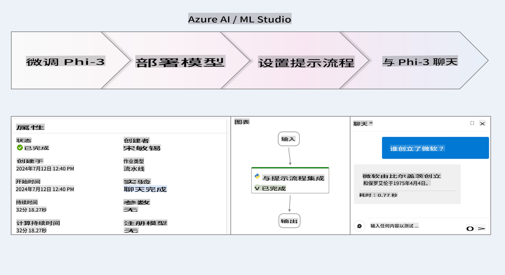

### 目录

1. **[场景 1：设置 Azure 资源并准备微调](../../../../md/06.E2ESamples)**
    - [创建 Azure Machine Learning 工作区](../../../../md/06.E2ESamples)
    - [在 Azure 订阅中请求 GPU 配额](../../../../md/06.E2ESamples)
    - [添加角色分配](../../../../md/06.E2ESamples)
    - [设置项目](../../../../md/06.E2ESamples)
    - [准备微调数据集](../../../../md/06.E2ESamples)

1. **[场景 2：微调 Phi-3 模型并在 Azure Machine Learning Studio 中部署](../../../../md/06.E2ESamples)**
    - [微调 Phi-3 模型](../../../../md/06.E2ESamples)
    - [部署微调后的 Phi-3 模型](../../../../md/06.E2ESamples)

1. **[场景 3：与 Prompt flow 集成并在 Azure AI Foundry 中与您的自定义模型聊天](../../../../md/06.E2ESamples)**
    - [将自定义 Phi-3 模型与 Prompt flow 集成](../../../../md/06.E2ESamples)
    - [与您的自定义 Phi-3 模型聊天](../../../../md/06.E2ESamples)

## 场景 1：设置 Azure 资源并准备微调

### 创建 Azure Machine Learning 工作区

1. 在门户页面顶部的 **搜索栏** 中输入 *azure machine learning*，并从出现的选项中选择 **Azure Machine Learning**。

    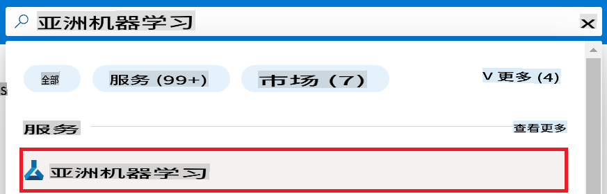

2. 从导航菜单中选择 **+ 创建**。

3. 从导航菜单中选择 **新工作区**。

    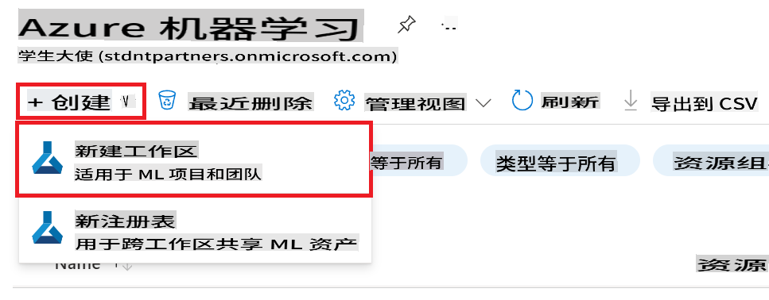

4. 执行以下任务：

    - 选择您的 Azure **订阅**。
    - 选择要使用的 **资源组**（如有需要可新建一个）。
    - 输入 **工作区名称**。它必须是唯一的值。
    - 选择您想使用的 **区域**。
    - 选择要使用的 **存储账户**（如有需要可新建一个）。
    - 选择要使用的 **密钥库**（如有需要可新建一个）。
    - 选择要使用的 **应用程序洞察**（如有需要可新建一个）。
    - 选择要使用的 **容器注册表**（如有需要可新建一个）。

    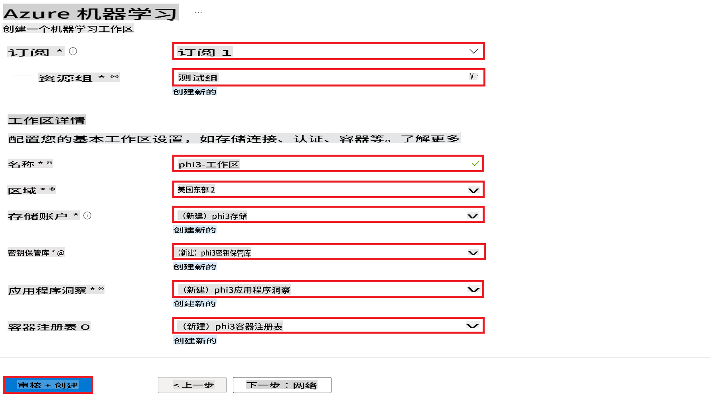

5. 选择 **查看 + 创建**。

6. 选择 **创建**。

### 在 Azure 订阅中请求 GPU 配额

在本教程中，您将学习如何使用 GPU 微调和部署 Phi-3 模型。对于微调，您将使用 *Standard_NC24ads_A100_v4* GPU，这需要请求配额。对于部署，您将使用 *Standard_NC6s_v3* GPU，这也需要请求配额。

> [!NOTE]
>
> 只有按需付费订阅（标准订阅类型）才有资格分配 GPU；目前不支持福利订阅。
>

1. 访问 [Azure ML Studio](https://ml.azure.com/home?wt.mc_id=studentamb_279723)。

1. 执行以下任务以请求 *Standard NCADSA100v4 Family* 配额：

    - 从左侧标签中选择 **配额**。
    - 选择要使用的 **虚拟机系列**。例如，选择 **Standard NCADSA100v4 Family Cluster Dedicated vCPUs**，其中包括 *Standard_NC24ads_A100_v4* GPU。
    - 从导航菜单中选择 **请求配额**。

        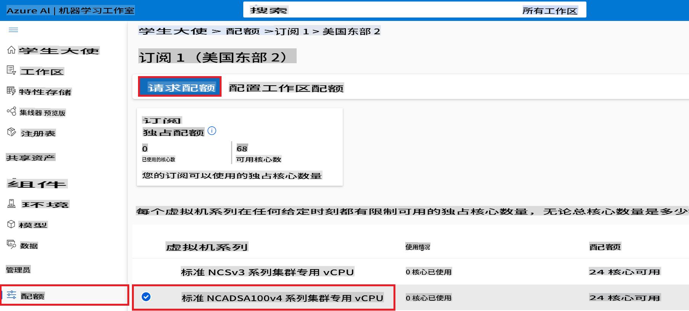

    - 在请求配额页面中，输入您想使用的 **新核心限制**。例如，24。
    - 在请求配额页面中，选择 **提交** 以请求 GPU 配额。

1. 执行以下任务以请求 *Standard NCSv3 Family* 配额：

    - 从左侧标签中选择 **配额**。
    - 选择要使用的 **虚拟机系列**。例如，选择 **Standard NCSv3 Family Cluster Dedicated vCPUs**，其中包括 *Standard_NC6s_v3* GPU。
    - 从导航菜单中选择 **请求配额**。
    - 在请求配额页面中，输入您想使用的 **新核心限制**。例如，24。
    - 在请求配额页面中，选择 **提交** 以请求 GPU 配额。

### 添加角色分配

要微调和部署您的模型，您必须首先创建一个用户分配的托管身份 (UAI) 并为其分配适当的权限。此 UAI 将在部署期间用于身份验证。

#### 创建用户分配的托管身份 (UAI)

1. 在门户页面顶部的 **搜索栏** 中输入 *managed identities*，并从出现的选项中选择 **Managed Identities**。

    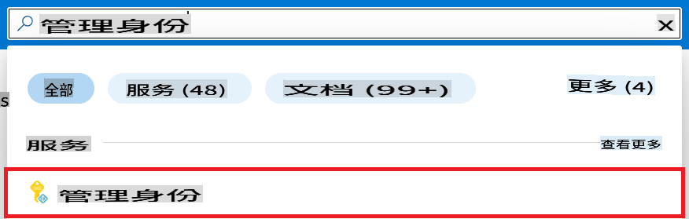

1. 选择 **+ 创建**。

    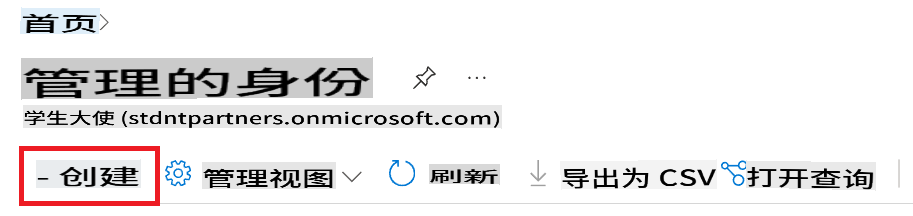

1. 执行以下任务：

    - 选择您的 Azure **订阅**。
    - 选择要使用的 **资源组**（如有需要可新建一个）。
    - 选择您想使用的 **区域**。
    - 输入 **名称**。它必须是唯一的值。

    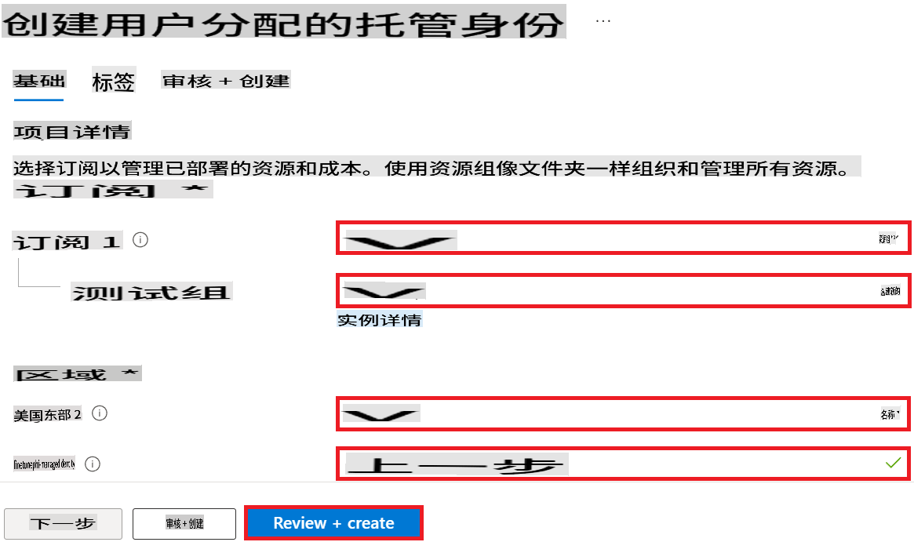

1. 选择 **查看 + 创建**。

1. 选择 **+ 创建**。

#### 为托管身份添加贡献者角色分配

1. 导航到您创建的托管身份资源。

1. 从左侧标签中选择 **Azure 角色分配**。

1. 从导航菜单中选择 **+ 添加角色分配**。

1. 在添加角色分配页面中，执行以下任务：
    - 将 **范围** 选择为 **资源组**。
    - 选择您的 Azure **订阅**。
    - 选择要使用的 **资源组**。
    - 将 **角色** 选择为 **贡献者**。

    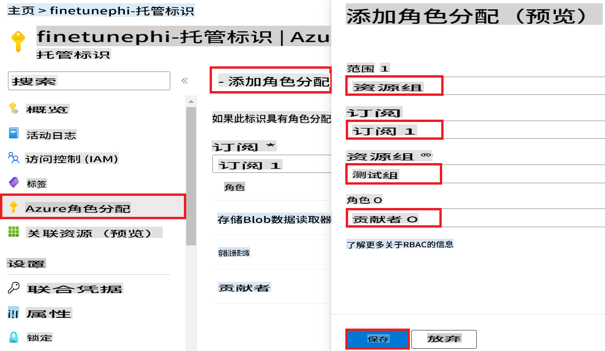

1. 选择 **保存**。

#### 为托管身份添加存储 Blob 数据读取器角色分配

1. 在门户页面顶部的 **搜索栏** 中输入 *storage accounts*，并从出现的选项中选择 **Storage accounts**。

    

1. 选择与您创建的 Azure Machine Learning 工作区关联的存储账户。例如，*finetunephistorage*。

1. 执行以下任务以导航到添加角色分配页面：

    - 导航到您创建的 Azure 存储账户。
    - 从左侧标签中选择 **访问控制 (IAM)**。
    - 从导航菜单中选择 **+ 添加**。
    - 从导航菜单中选择 **添加角色分配**。

    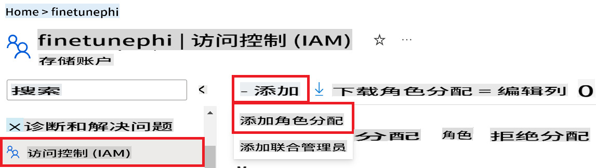

1. 在添加角色分配页面中，执行以下任务：

    - 在角色页面中，在 **搜索栏** 中输入 *Storage Blob Data Reader* 并从出现的选项中选择 **Storage Blob Data Reader**。
    - 在角色页面中选择 **下一步**。
    - 在成员页面中，将 **分配访问权限给** 选择为 **托管身份**。
    - 在成员页面中选择 **+ 选择成员**。
    - 在选择托管身份页面中，选择您的 Azure **订阅**。
    - 在选择托管身份页面中，将 **托管身份** 选择为 **托管身份**。
    - 在选择托管身份页面中，选择您创建的托管身份。例如，*finetunephi-managedidentity*。
    - 在选择托管身份页面中选择 **选择**。

    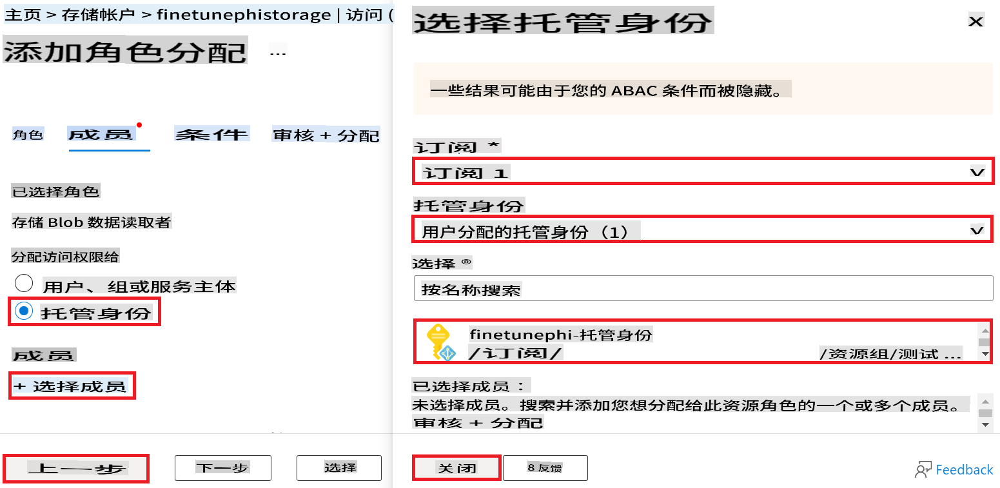

1. 选择 **查看 + 分配**。

#### 为托管身份添加 AcrPull 角色分配

1. 在门户页面顶部的 **搜索栏** 中输入 *container registries*，并从出现的选项中选择 **Container registries**。

    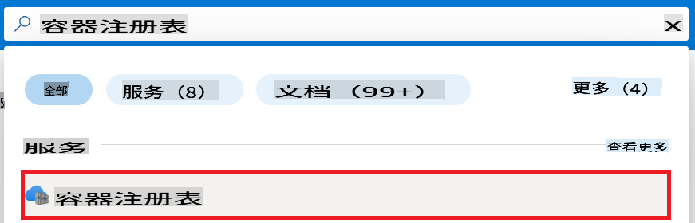

1. 选择与 Azure Machine Learning 工作区关联的容器注册表。例如，*finetunephicontainerregistry*

1. 执行以下任务以导航到添加角色分配页面：

    - 从左侧标签中选择 **访问控制 (IAM)**。
    - 从导航菜单中选择 **+ 添加**。
    - 从导航菜单中选择 **添加角色分配**。

1. 在添加角色分配页面中，执行以下任务：

    - 在角色页面中，在 **搜索栏** 中输入 *AcrPull* 并从出现的选项中选择 **AcrPull**。
    - 在角色页面中选择 **下一步**。
    - 在成员页面中，将 **分配访问权限给** 选择为 **托管身份**。
    - 在成员页面中选择 **+ 选择成员**。
    - 在选择托管身份页面中，选择您的 Azure **订阅**。
    - 在选择托管身份页面中，将 **托管身份** 选择为 **托管身份**。
    - 在选择托管身份页面中，选择您创建的托管身份。例如，*finetunephi-managedidentity*。
    - 在选择托管身份页面中选择 **选择**。
    - 选择 **查看 + 分配**。

### 设置项目

为了下载微调所需的数据集，您将设置一个本地环境。

在这个练习中，您将：

- 创建一个文件夹来在其中工作。
- 创建一个虚拟环境。
- 安装所需的软件包。
- 创建一个 *download_dataset.py* 文件来下载数据集。

#### 创建一个文件夹来在其中工作

1. 打开终端窗口，输入以下命令在默认路径中创建一个名为 *finetune-phi* 的文件夹。

    ```console
    mkdir finetune-phi
    ```

2. 在终端中输入以下命令以导航到您创建的 *finetune-phi* 文件夹。

    ```console
    cd finetune-phi
    ```

#### 创建一个虚拟环境

1. 在终端中输入以下命令以创建一个名为 *.venv* 的虚拟环境。

    ```console
    python -m venv .venv
    ```

2. 在终端中输入以下命令以激活虚拟环境。

    ```console
    .venv\Scripts\activate.bat
    ```

> [!NOTE]
> 如果成功，您应该在命令提示符前看到 *(.venv)*。

#### 安装所需的软件包

1. 在终端中输入以下命令以安装所需的软件包。

    ```console
    pip install datasets==2.19.1
    ```

#### 创建 `download_dataset.py`

> [!NOTE]
> 完整文件夹结构：
>
> ```text
> └── YourUserName
> .    └── finetune-phi
> .        └── download_dataset.py
> ```

1. 打开 **Visual Studio Code**。

1. 从菜单栏中选择 **文件**。

1. 选择 **打开文件夹**。

1. 选择您创建的 *finetune-phi* 文件夹，位于 *C:\Users\yourUserName\finetune-phi*。

    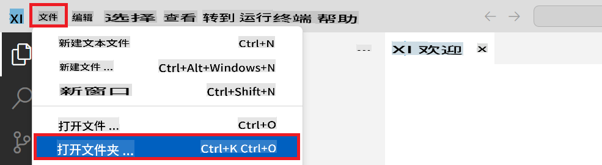

1. 在 Visual Studio Code 的左侧窗格中，右键单击并选择 **新建文件** 以创建一个名为 *download_dataset.py* 的新文件。

    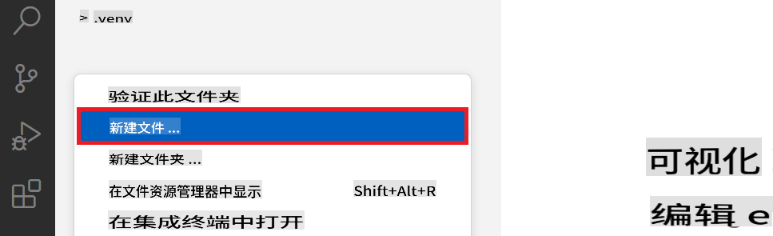

### 准备微调数据集

在这个练习中，您将运行 *download_dataset.py* 文件以将 *ultrachat_200k* 数据集下载到本地环境。然后，您将使用这些数据集在 Azure Machine Learning 中微调 Phi-3 模型。

在这个练习中，您将：

- 向 *download_dataset.py* 文件添加代码以下载数据集。
- 运行 *download_dataset.py* 文件以将数据集下载到本地环境。

#### 使用 *download_dataset.py* 下载数据集

1. 在 Visual Studio Code 中打开 *download_dataset.py* 文件。

1. 将以下代码添加到 *download_dataset.py* 文件中。

    ```python
    import json
    import os
    from datasets import load_dataset

    def load_and_split_dataset(dataset_name, config_name, split_ratio):
        """
        Load and split a dataset.
        """
        # Load the dataset with the specified name, configuration, and split ratio
        dataset = load_dataset(dataset_name, config_name, split=split_ratio)
        print(f"Original dataset size: {len(dataset)}")
        
        # Split the dataset into train and test sets (80% train, 20% test)
        split_dataset = dataset.train_test_split(test_size=0.2)
        print(f"Train dataset size: {len(split_dataset['train'])}")
        print(f"Test dataset size: {len(split_dataset['test'])}")
        
        return split_dataset

    def save_dataset_to_jsonl(dataset, filepath):
        """
        Save a dataset to a JSONL file.
        """
        # Create the directory if it does not exist
        os.makedirs(os.path.dirname(filepath), exist_ok=True)
        
        # Open the file in write mode
        with open(filepath, 'w', encoding='utf-8') as f:
            # Iterate over each record in the dataset
            for record in dataset:
                # Dump the record as a JSON object and write it to the file
                json.dump(record, f)
                # Write a newline character to separate records
                f.write('\n')
        
        print(f"Dataset saved to {filepath}")

    def main():
        """
        Main function to load, split, and save the dataset.
        """
        # Load and split the ULTRACHAT_200k dataset with a specific configuration and split ratio
        dataset = load_and_split_dataset("HuggingFaceH4/ultrachat_200k", 'default', 'train_sft[:1%]')
        
        # Extract the train and test datasets from the split
        train_dataset = dataset['train']
        test_dataset = dataset['test']

        # Save the train dataset to a JSONL file
        save_dataset_to_jsonl(train_dataset, "data/train_data.jsonl")
        
        # Save the test dataset to a separate JSONL file
        save_dataset_to_jsonl(test_dataset, "data/test_data.jsonl")

    if __name__ == "__main__":
        main()

    ```

1. 在终端中输入以下命令以运行脚本并将数据集下载到本地环境。

    ```console
    python download_dataset.py
    ```

1. 验证数据集是否已成功保存到本地 *finetune-phi/data* 目录。

> [!NOTE]
>
> #### 关于数据集大小和微调时间的说明
>
> 在本教程中，您仅使用数据集的 1% (`split='train[:1%]'`)。这大大减少了数据量，加快了上传和微调过程。您可以调整百分比以找到训练时间和模型性能之间的最佳平衡。使用较小的子集可以减少微调所需的时间，使过程更易于管理。

## 场景 2：微调 Phi-3 模型并在 Azure Machine Learning Studio 中部署

### 微调 Phi-3 模型

在这个练习中，您将在 Azure Machine Learning Studio 中微调 Phi-3 模型。

在这个练习中，您将：

- 创建用于微调的计算机集群。
- 在 Azure Machine Learning Studio 中微调 Phi-3 模型。

#### 创建用于微调的计算机集群
1. 访问 [Azure ML Studio](https://ml.azure.com/home?wt.mc_id=studentamb_279723)。

1. 从左侧标签中选择 **Compute**。

1. 从导航菜单中选择 **Compute clusters**。

1. 选择 **+ New**。

    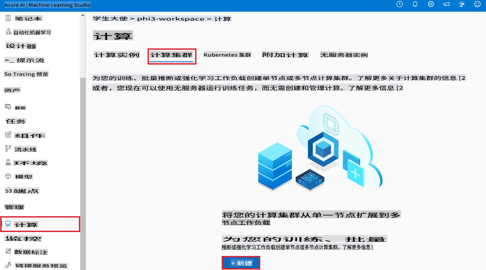

1. 执行以下任务：

    - 选择你想使用的 **Region**。
    - 将 **Virtual machine tier** 选择为 **Dedicated**。
    - 将 **Virtual machine type** 选择为 **GPU**。
    - 将 **Virtual machine size** 筛选条件选择为 **Select from all options**。
    - 将 **Virtual machine size** 选择为 **Standard_NC24ads_A100_v4**。

    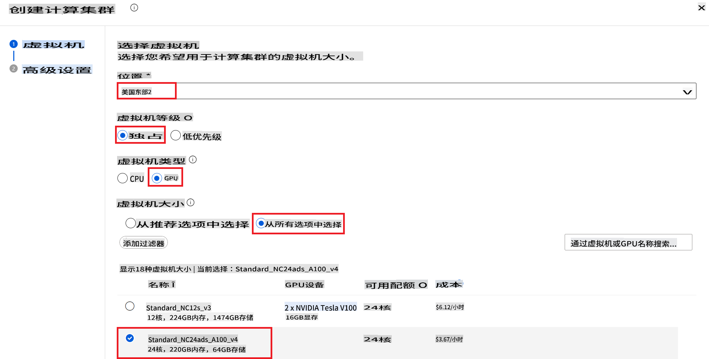

1. 选择 **Next**。

1. 执行以下任务：

    - 输入 **Compute name**。它必须是唯一值。
    - 将 **Minimum number of nodes** 选择为 **0**。
    - 将 **Maximum number of nodes** 选择为 **1**。
    - 将 **Idle seconds before scale down** 选择为 **120**。

    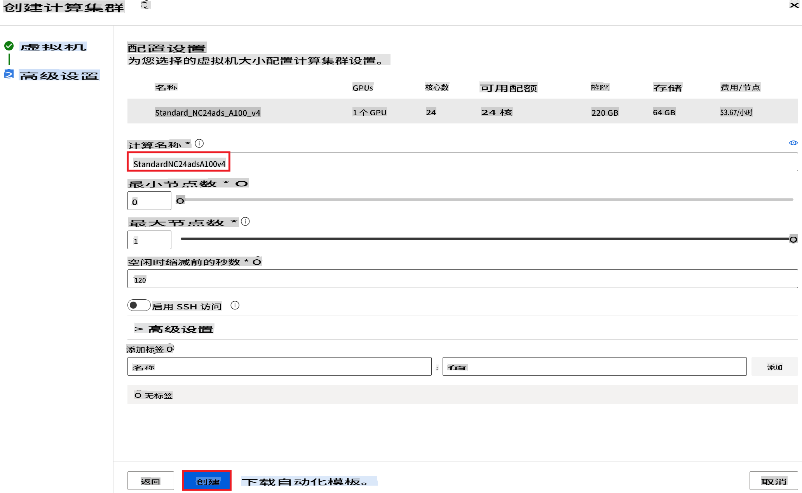

1. 选择 **Create**。

#### 微调 Phi-3 模型

1. 访问 [Azure ML Studio](https://ml.azure.com/home?wt.mc_id=studentamb_279723)。

1. 选择你创建的 Azure 机器学习工作区。

    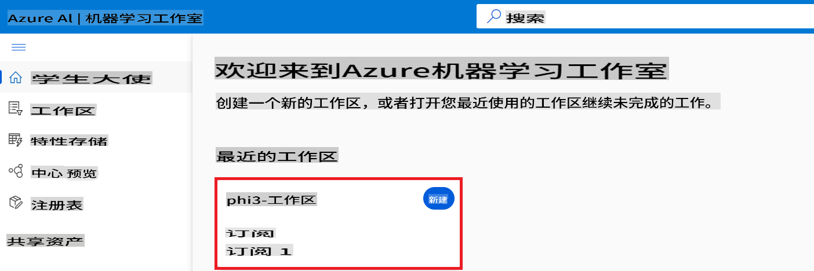

1. 执行以下任务：

    - 从左侧标签中选择 **Model catalog**。
    - 在 **search bar** 中输入 *phi-3-mini-4k* 并从出现的选项中选择 **Phi-3-mini-4k-instruct**。

    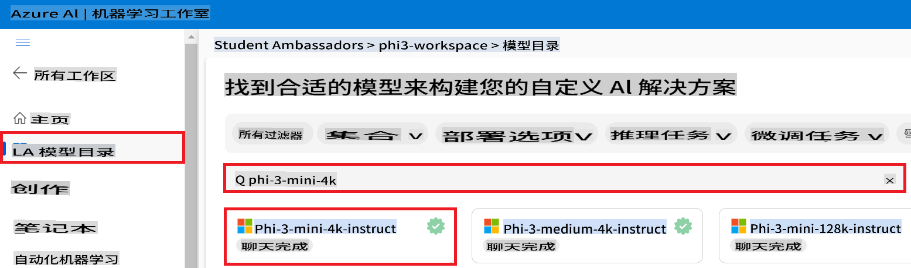

1. 从导航菜单中选择 **Fine-tune**。

    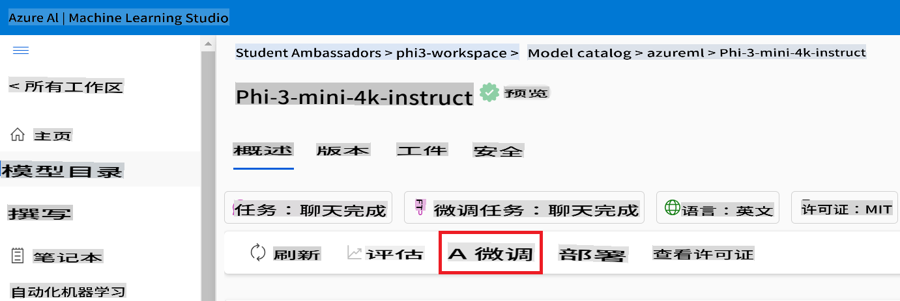

1. 执行以下任务：

    - 将 **Select task type** 选择为 **Chat completion**。
    - 选择 **+ Select data** 上传 **Training data**。
    - 将验证数据上传类型选择为 **Provide different validation data**。
    - 选择 **+ Select data** 上传 **Validation data**。

    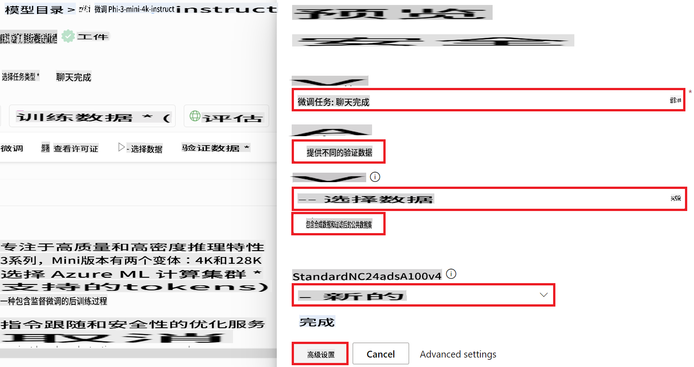

    > [!TIP]
    >
    > 你可以选择 **Advanced settings** 自定义配置，如 **learning_rate** 和 **lr_scheduler_type**，以根据你的具体需求优化微调过程。

1. 选择 **Finish**。

1. 在这个练习中，你成功地使用 Azure 机器学习微调了 Phi-3 模型。请注意，微调过程可能需要相当长的时间。在运行微调任务后，你需要等待其完成。你可以通过导航到 Azure 机器学习工作区左侧的 Jobs 标签来监控微调任务的状态。在接下来的系列中，你将部署微调后的模型并将其与 Prompt flow 集成。

    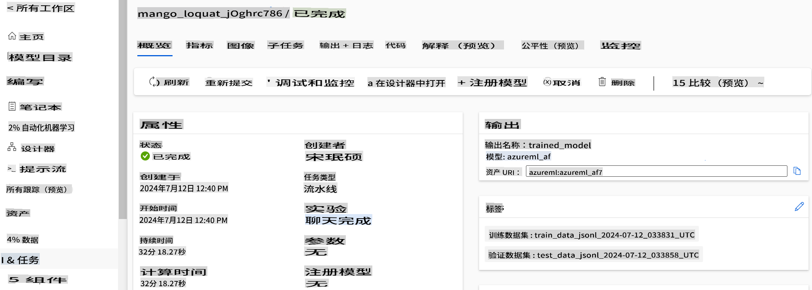

### 部署微调后的 Phi-3 模型

为了将微调后的 Phi-3 模型与 Prompt flow 集成，你需要部署模型以便进行实时推理。此过程包括注册模型、创建在线端点并部署模型。

在这个练习中，你将：

- 在 Azure 机器学习工作区中注册微调后的模型。
- 创建一个在线端点。
- 部署已注册的微调后的 Phi-3 模型。

#### 注册微调后的模型

1. 访问 [Azure ML Studio](https://ml.azure.com/home?wt.mc_id=studentamb_279723)。

1. 选择你创建的 Azure 机器学习工作区。

    

1. 从左侧标签中选择 **Models**。
1. 选择 **+ Register**。
1. 选择 **From a job output**。

    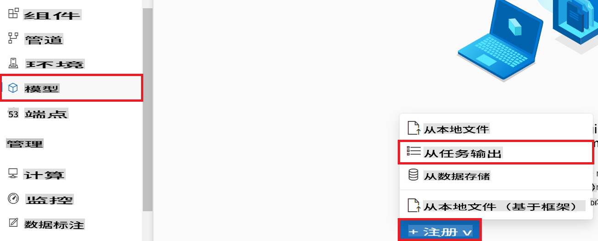

1. 选择你创建的任务。

    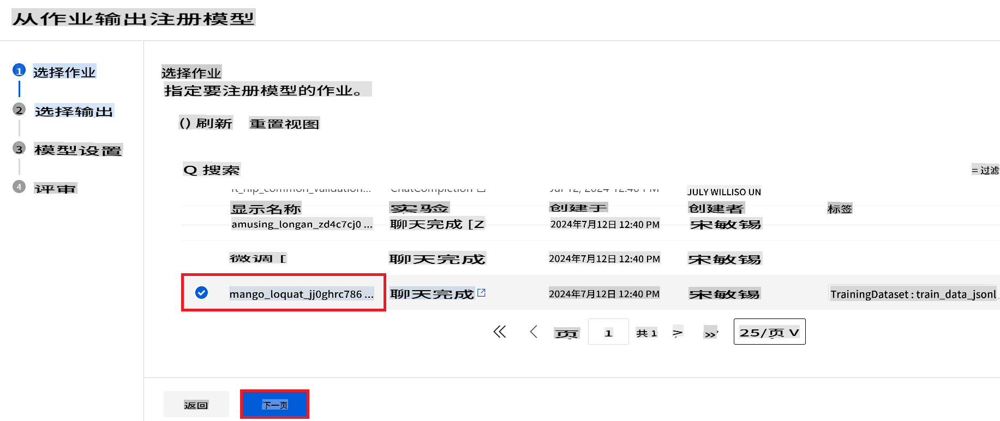

1. 选择 **Next**。

1. 将 **Model type** 选择为 **MLflow**。

1. 确保选择了 **Job output**，它应该是自动选择的。

    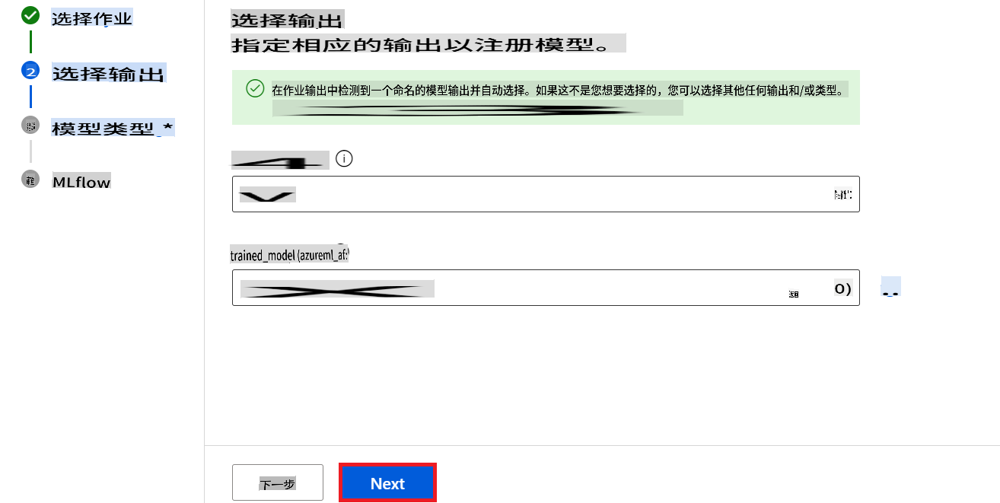

1. 选择 **Next**。

1. 选择 **Register**。

    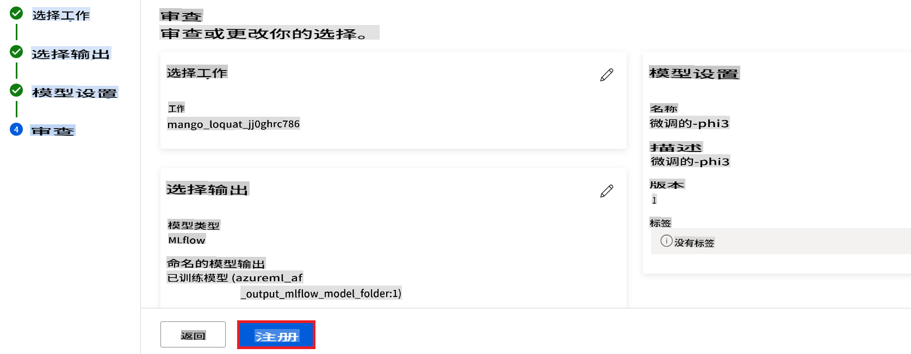

1. 你可以通过导航到左侧标签中的 **Models** 菜单查看你注册的模型。

    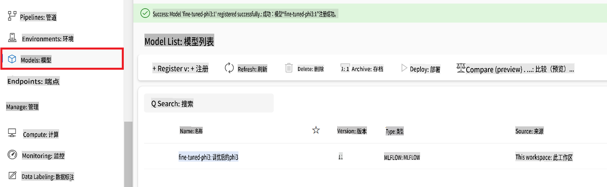

#### 部署微调后的模型

1. 导航到你创建的 Azure 机器学习工作区。

1. 从左侧标签中选择 **Endpoints**。

1. 从导航菜单中选择 **Real-time endpoints**。

    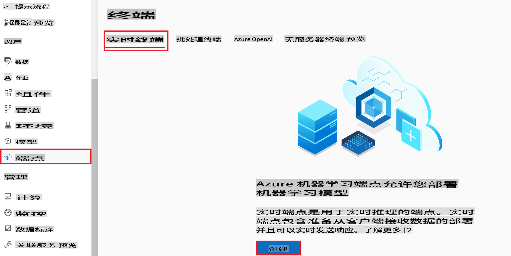

1. 选择 **Create**。

1. 选择你创建的已注册模型。

    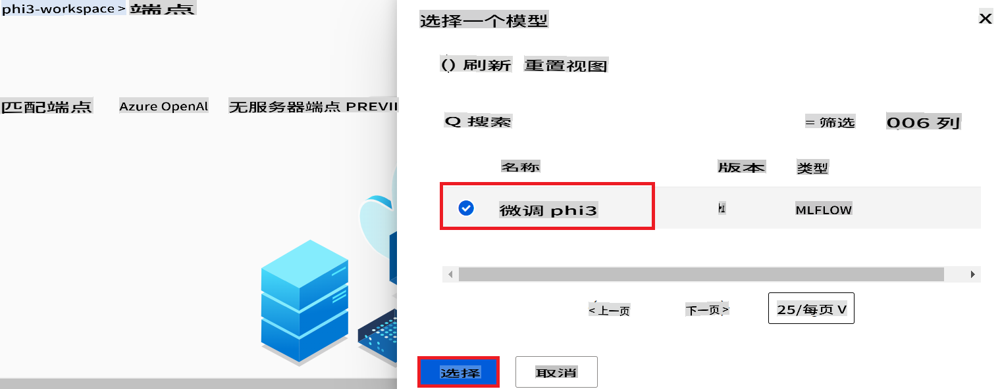

1. 选择 **Select**。

1. 执行以下任务：

    - 将 **Virtual machine** 选择为 *Standard_NC6s_v3*。
    - 选择你想使用的 **Instance count**。例如，*1*。
    - 将 **Endpoint** 选择为 **New** 以创建一个端点。
    - 输入 **Endpoint name**。它必须是唯一值。
    - 输入 **Deployment name**。它必须是唯一值。

    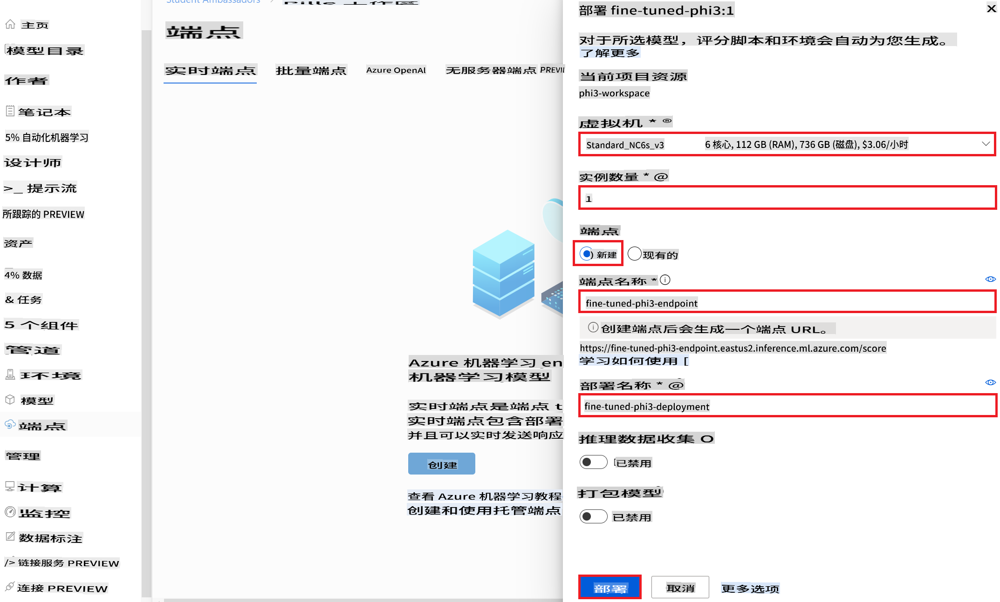

1. 选择 **Deploy**。

> [!WARNING]
> 为避免对你的账户产生额外费用，请确保删除在 Azure 机器学习工作区中创建的端点。
>

#### 检查 Azure 机器学习工作区中的部署状态

1. 导航到你创建的 Azure 机器学习工作区。

1. 从左侧标签中选择 **Endpoints**。

1. 选择你创建的端点。

    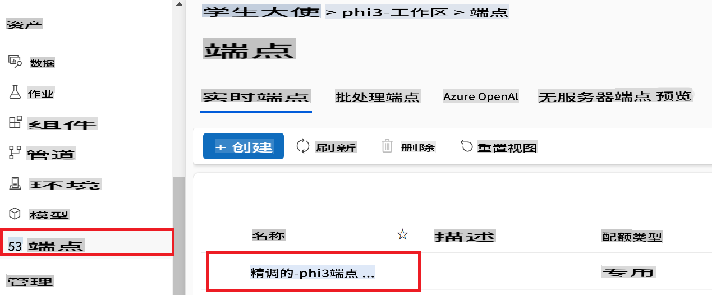

1. 在此页面中，你可以在部署过程中管理端点。

> [!NOTE]
> 部署完成后，确保 **Live traffic** 设置为 **100%**。如果不是，请选择 **Update traffic** 以调整流量设置。注意，如果流量设置为 0%，你将无法测试模型。
>
> 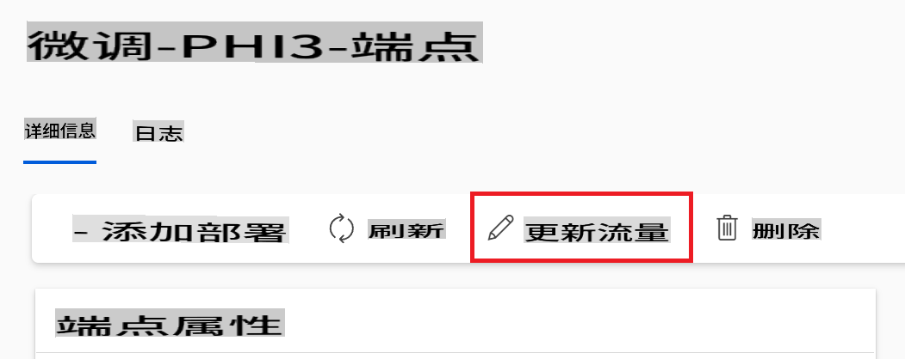
>

## 场景 3：在 Azure AI Foundry 中集成 Prompt flow 并与自定义模型聊天

### 将自定义 Phi-3 模型与 Prompt flow 集成

在成功部署你的微调模型后，你现在可以将其与 Prompt Flow 集成，以便在实时应用中使用你的模型，从而实现各种与自定义 Phi-3 模型的交互任务。

在这个练习中，你将：

- 创建 Azure AI Foundry Hub。
- 创建 Azure AI Foundry Project。
- 创建 Prompt flow。
- 为微调后的 Phi-3 模型添加自定义连接。
- 设置 Prompt flow 以与自定义 Phi-3 模型聊天。

> [!NOTE]
> 你也可以使用 Azure ML Studio 与 Promptflow 集成。同样的集成过程可以应用于 Azure ML Studio。

#### 创建 Azure AI Foundry Hub

在创建 Project 之前，你需要创建一个 Hub。Hub 类似于资源组，允许你在 Azure AI Foundry 中组织和管理多个 Project。

1. 访问 [Azure AI Foundry](https://ai.azure.com/?WT.mc_id=aiml-137032-kinfeylo)。

1. 从左侧标签中选择 **All hubs**。

1. 从导航菜单中选择 **+ New hub**。

    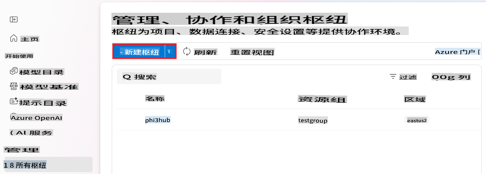

1. 执行以下任务：

    - 输入 **Hub name**。它必须是唯一值。
    - 选择你的 Azure **Subscription**。
    - 选择要使用的 **Resource group**（如有需要，创建一个新的）。
    - 选择你想使用的 **Location**。
    - 选择要使用的 **Connect Azure AI Services**（如有需要，创建一个新的）。
    - 将 **Connect Azure AI Search** 选择为 **Skip connecting**。

    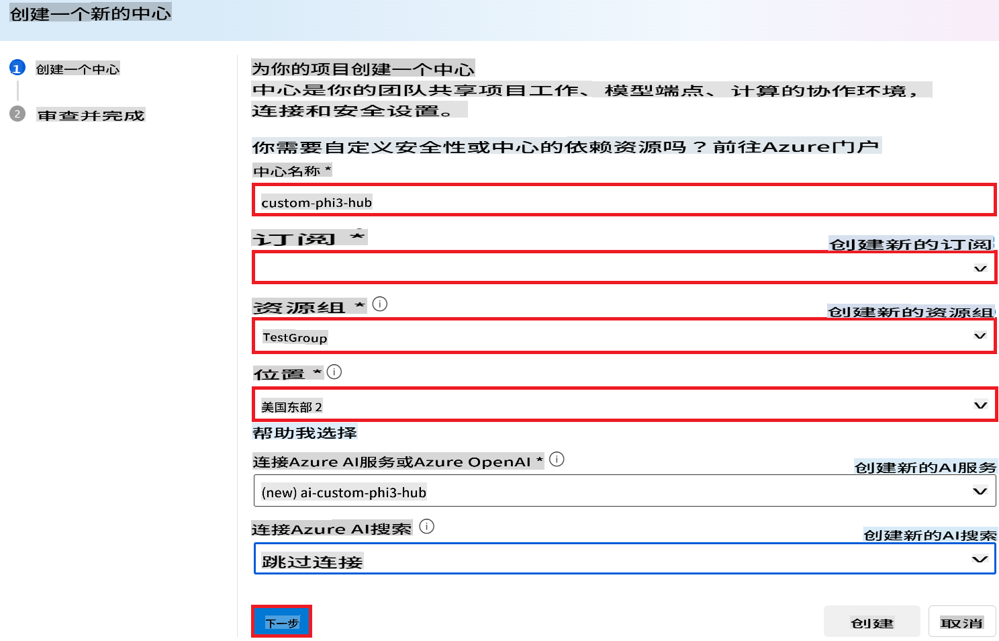

1. 选择 **Next**。

#### 创建 Azure AI Foundry Project

1. 在你创建的 Hub 中，从左侧标签中选择 **All projects**。

1. 从导航菜单中选择 **+ New project**。

    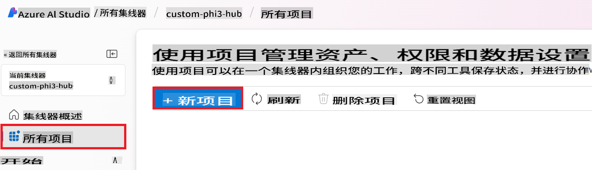

1. 输入 **Project name**。它必须是唯一值。

    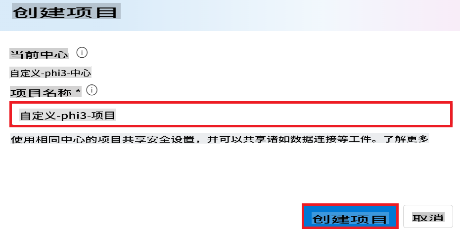

1. 选择 **Create a project**。

#### 为微调后的 Phi-3 模型添加自定义连接

为了将你的自定义 Phi-3 模型与 Prompt flow 集成，你需要在自定义连接中保存模型的端点和密钥。此设置确保在 Prompt flow 中访问你的自定义 Phi-3 模型。

#### 设置微调后的 Phi-3 模型的 API 密钥和端点 URI

1. 访问 [Azure ML Studio](https://ml.azure.com/home?WT.mc_id=aiml-137032-kinfeylo)。

1. 导航到你创建的 Azure 机器学习工作区。

1. 从左侧标签中选择 **Endpoints**。

    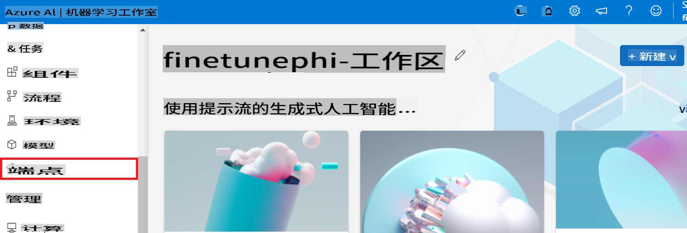

1. 选择你创建的端点。

    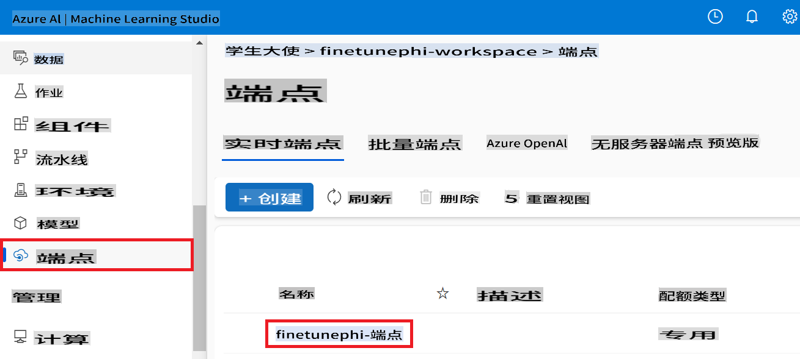

1. 从导航菜单中选择 **Consume**。

1. 复制你的 **REST endpoint** 和 **Primary key**。
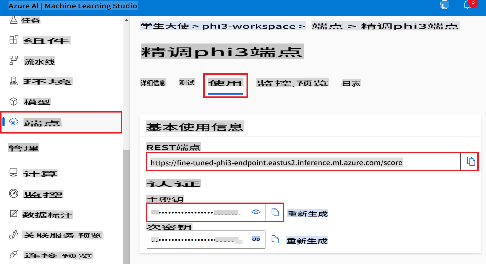

#### 添加自定义连接

1. 访问 [Azure AI Foundry](https://ai.azure.com/?WT.mc_id=aiml-137032-kinfeylo)。

1. 导航到你创建的Azure AI Foundry项目。

1. 在你创建的项目中，从左侧标签中选择 **Settings**。

1. 选择 **+ New connection**。

    

1. 从导航菜单中选择 **Custom keys**。

    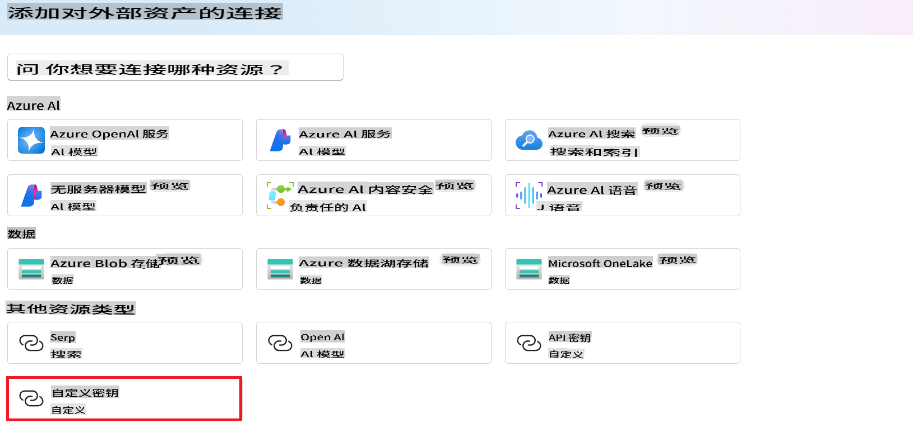

1. 执行以下任务：

    - 选择 **+ Add key value pairs**。
    - 对于密钥名称，输入 **endpoint** 并将你从Azure ML Studio复制的终端粘贴到值字段中。
    - 再次选择 **+ Add key value pairs**。
    - 对于密钥名称，输入 **key** 并将你从Azure ML Studio复制的密钥粘贴到值字段中。
    - 添加密钥后，选择 **is secret** 以防止密钥暴露。

    

1. 选择 **Add connection**。

#### 创建提示流

你已经在Azure AI Foundry中添加了一个自定义连接。现在，让我们按照以下步骤创建一个提示流。然后，你将把这个提示流连接到自定义连接，以便在提示流中使用微调后的模型。

1. 导航到你创建的Azure AI Foundry项目。

1. 从左侧标签中选择 **Prompt flow**。

1. 从导航菜单中选择 **+ Create**。

    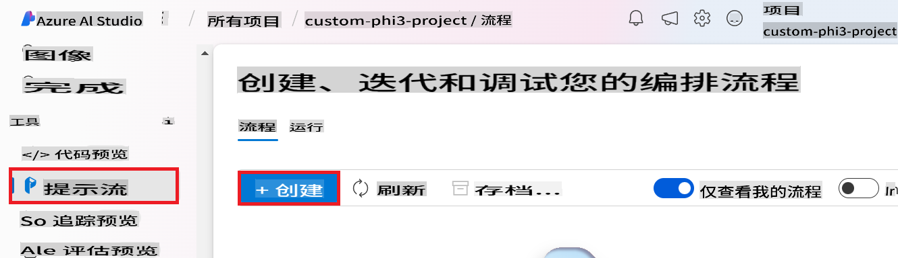

1. 从导航菜单中选择 **Chat flow**。

    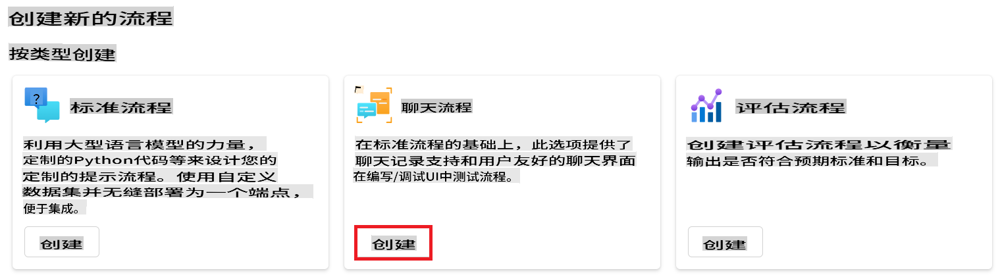

1. 输入 **文件夹名称**。

    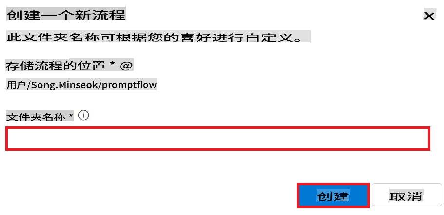

1. 选择 **Create**。

#### 设置提示流与自定义Phi-3模型聊天

你需要将微调后的Phi-3模型集成到提示流中。然而，现有的提示流并不是为此设计的。因此，你必须重新设计提示流以实现自定义模型的集成。

1. 在提示流中，执行以下任务以重建现有流：

    - 选择 **Raw file mode**。
    - 删除 *flow.dag.yml* 文件中的所有现有代码。
    - 将以下代码添加到 *flow.dag.yml* 文件中。

        ```yml
        inputs:
          input_data:
            type: string
            default: "Who founded Microsoft?"

        outputs:
          answer:
            type: string
            reference: ${integrate_with_promptflow.output}

        nodes:
        - name: integrate_with_promptflow
          type: python
          source:
            type: code
            path: integrate_with_promptflow.py
          inputs:
            input_data: ${inputs.input_data}
        ```

    - 选择 **Save**。

    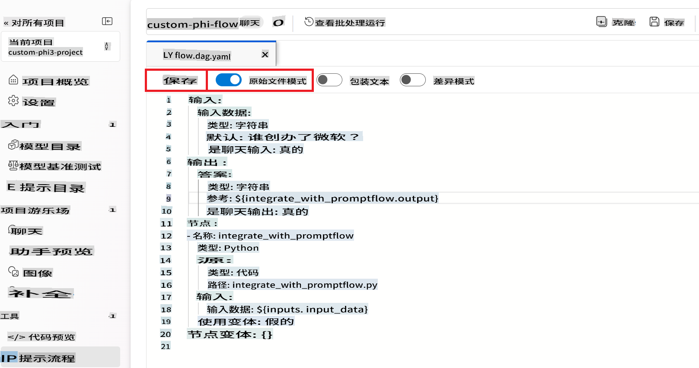

1. 将以下代码添加到 *integrate_with_promptflow.py* 文件中，以在提示流中使用自定义Phi-3模型。

    ```python
    import logging
    import requests
    from promptflow import tool
    from promptflow.connections import CustomConnection

    # Logging setup
    logging.basicConfig(
        format="%(asctime)s - %(levelname)s - %(name)s - %(message)s",
        datefmt="%Y-%m-%d %H:%M:%S",
        level=logging.DEBUG
    )
    logger = logging.getLogger(__name__)

    def query_phi3_model(input_data: str, connection: CustomConnection) -> str:
        """
        Send a request to the Phi-3 model endpoint with the given input data using Custom Connection.
        """

        # "connection" is the name of the Custom Connection, "endpoint", "key" are the keys in the Custom Connection
        endpoint_url = connection.endpoint
        api_key = connection.key

        headers = {
            "Content-Type": "application/json",
            "Authorization": f"Bearer {api_key}"
        }
        data = {
            "input_data": {
                "input_string": [
                    {"role": "user", "content": input_data}
                ],
                "parameters": {
                    "temperature": 0.7,
                    "max_new_tokens": 128
                }
            }
        }
        try:
            response = requests.post(endpoint_url, json=data, headers=headers)
            response.raise_for_status()
            
            # Log the full JSON response
            logger.debug(f"Full JSON response: {response.json()}")

            result = response.json()["output"]
            logger.info("Successfully received response from Azure ML Endpoint.")
            return result
        except requests.exceptions.RequestException as e:
            logger.error(f"Error querying Azure ML Endpoint: {e}")
            raise

    @tool
    def my_python_tool(input_data: str, connection: CustomConnection) -> str:
        """
        Tool function to process input data and query the Phi-3 model.
        """
        return query_phi3_model(input_data, connection)

    ```

    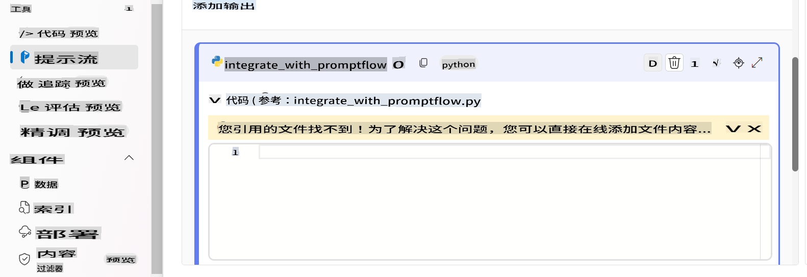

> [!NOTE]
> 有关在Azure AI Foundry中使用提示流的更多详细信息，你可以参考 [Azure AI Foundry中的提示流](https://learn.microsoft.com/azure/ai-studio/how-to/prompt-flow)。

1. 选择 **Chat input** 和 **Chat output** 以启用与模型的聊天功能。

    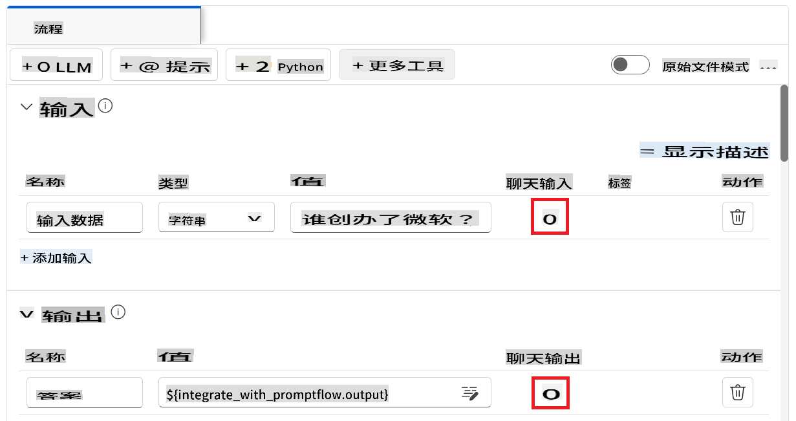

1. 现在你已经准备好与自定义Phi-3模型聊天。在下一个练习中，你将学习如何启动提示流并使用它与微调后的Phi-3模型聊天。

> [!NOTE]
>
> 重建的流应如下图所示：
>
> 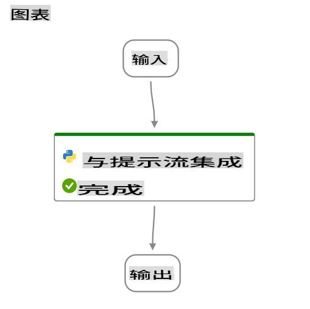
>

### 与自定义Phi-3模型聊天

现在你已经微调并将自定义Phi-3模型集成到提示流中，你可以开始与它进行互动。本练习将指导你如何设置并启动与模型的聊天。通过遵循这些步骤，你将能够充分利用微调后的Phi-3模型进行各种任务和对话。

- 使用提示流与自定义Phi-3模型聊天。

#### 启动提示流

1. 选择 **Start compute sessions** 以启动提示流。

    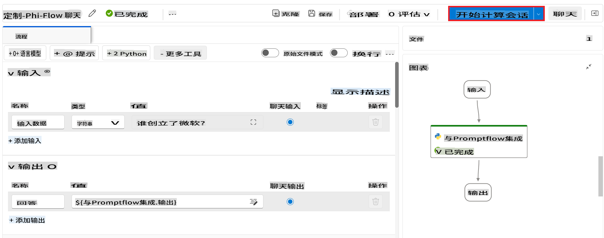

1. 选择 **Validate and parse input** 以更新参数。

    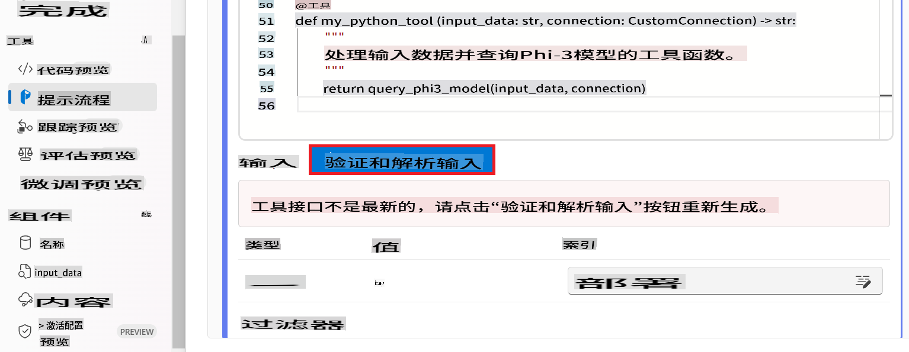

1. 选择 **connection** 的 **Value** 以连接到你创建的自定义连接。例如，*connection*。

    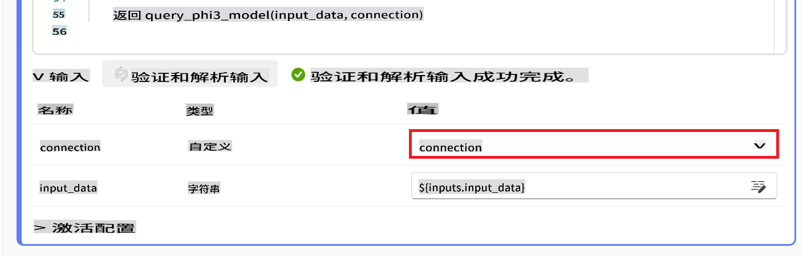

#### 与自定义模型聊天

1. 选择 **Chat**。

    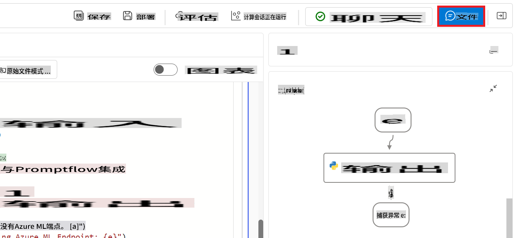

1. 以下是结果示例：现在你可以与自定义Phi-3模型聊天。建议根据用于微调的数据提问。

    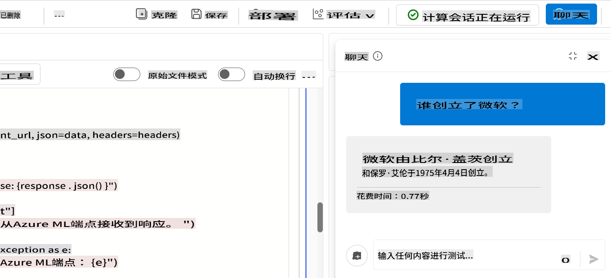

**免责声明**：
本文档使用基于机器的人工智能翻译服务进行翻译。尽管我们努力确保准确性，但请注意，自动翻译可能包含错误或不准确之处。应将原始语言的文档视为权威来源。对于关键信息，建议使用专业人工翻译。我们对使用此翻译所引起的任何误解或误读不承担责任。