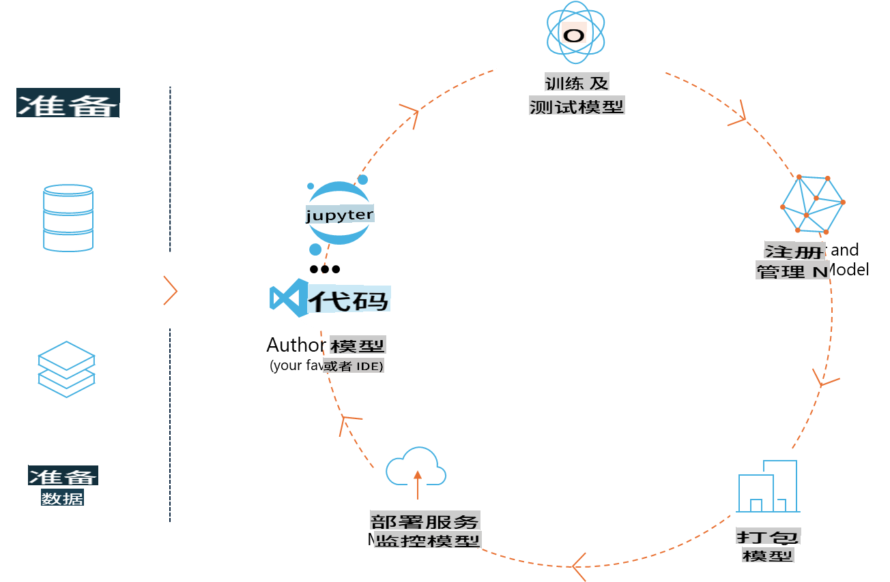
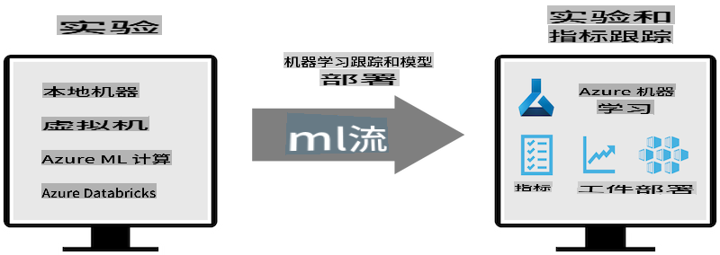
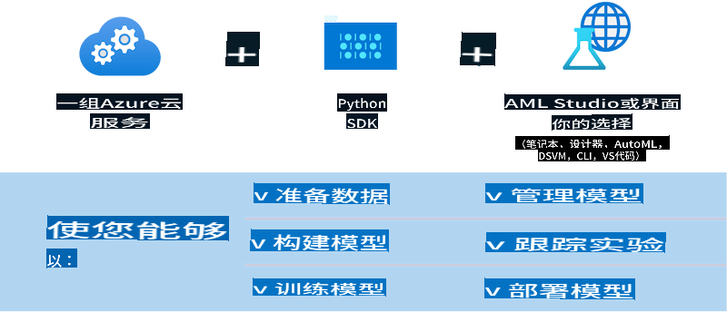

# MLflow

[MLflow](https://mlflow.org/) 是一个开源平台，旨在管理端到端的机器学习生命周期。



MLFlow 用于管理机器学习生命周期，包括实验、可重复性、部署和中央模型注册。MLFlow 目前提供四个组件：

- **MLflow Tracking:** 记录和查询实验、代码、数据配置和结果。
- **MLflow Projects:** 以一种格式打包数据科学代码，以便在任何平台上重现运行。
- **Mlflow Models:** 在各种服务环境中部署机器学习模型。
- **Model Registry:** 在中央存储库中存储、注释和管理模型。

它包括实验跟踪、将代码打包成可重现的运行以及共享和部署模型的功能。MLFlow 集成到 Databricks 中，支持各种机器学习库，使其与库无关。它可以与任何机器学习库和任何编程语言一起使用，因为它提供了 REST API 和 CLI 以方便使用。



MLFlow 的主要功能包括：

- **实验跟踪:** 记录和比较参数和结果。
- **模型管理:** 将模型部署到各种服务和推理平台。
- **模型注册:** 协作管理 MLflow 模型的生命周期，包括版本控制和注释。
- **项目:** 打包机器学习代码以便共享或生产使用。

MLFlow 还支持 MLOps 循环，包括准备数据、注册和管理模型、打包模型以供执行、部署服务和监控模型。它旨在简化从原型到生产工作流的过程，特别是在云和边缘环境中。

## 端到端场景 - 构建包装器并将 Phi-3 用作 MLFlow 模型

在这个端到端示例中，我们将展示两种不同的方法来构建围绕 Phi-3 小型语言模型 (SLM) 的包装器，然后将其作为 MLFlow 模型在本地或云中运行，例如在 Azure Machine Learning 工作区中。



| 项目 | 描述 | 位置 |
| ------------ | ----------- | -------- |
| Transformer Pipeline | 如果您想使用 HuggingFace 模型与 MLFlow 的实验性 transformers flavour，Transformer Pipeline 是构建包装器的最简单选项。 | [**TransformerPipeline.ipynb**](../../../../code/06.E2E/E2E_Phi-3-MLflow_TransformerPipeline.ipynb) |
| 自定义 Python 包装器 | 在撰写本文时，transformer pipeline 不支持为 ONNX 格式的 HuggingFace 模型生成 MLFlow 包装器，即使使用实验性的 optimum Python 包。对于这种情况，您可以为 MLFlow 模式构建自定义 Python 包装器 | [**CustomPythonWrapper.ipynb**](../../../../code/06.E2E/E2E_Phi-3-MLflow_CustomPythonWrapper.ipynb) |

## 项目: Transformer Pipeline

1. 您需要从 MLFlow 和 HuggingFace 获取相关的 Python 包：

    ``` Python
    import mlflow
    import transformers
    ```

2. 接下来，您应该通过引用 HuggingFace 注册表中的目标 Phi-3 模型来启动 transformer pipeline。从 _Phi-3-mini-4k-instruct_ 的模型卡可以看出，它的任务类型是“文本生成”：

    ``` Python
    pipeline = transformers.pipeline(
        task = "text-generation",
        model = "microsoft/Phi-3-mini-4k-instruct"
    )
    ```

3. 您现在可以将 Phi-3 模型的 transformer pipeline 保存为 MLFlow 格式，并提供额外的细节，如目标工件路径、特定模型配置设置和推理 API 类型：

    ``` Python
    model_info = mlflow.transformers.log_model(
        transformers_model = pipeline,
        artifact_path = "phi3-mlflow-model",
        model_config = model_config,
        task = "llm/v1/chat"
    )
    ```

## 项目: 自定义 Python 包装器

1. 我们可以利用微软的 [ONNX Runtime generate() API](https://github.com/microsoft/onnxruntime-genai) 进行 ONNX 模型的推理和 tokens 编码/解码。您必须为目标计算选择 _onnxruntime_genai_ 包，以下示例针对 CPU：

    ``` Python
    import mlflow
    from mlflow.models import infer_signature
    import onnxruntime_genai as og
    ```

1. 我们的自定义类实现了两个方法：_load_context()_ 初始化 **ONNX 模型** Phi-3 Mini 4K Instruct、**生成器参数** 和 **tokenizer**；以及 _predict()_ 生成提供的提示的输出 tokens：

    ``` Python
    class Phi3Model(mlflow.pyfunc.PythonModel):
        def load_context(self, context):
            # 从工件中检索模型
            model_path = context.artifacts["phi3-mini-onnx"]
            model_options = {
                 "max_length": 300,
                 "temperature": 0.2,         
            }
        
            # 定义模型
            self.phi3_model = og.Model(model_path)
            self.params = og.GeneratorParams(self.phi3_model)
            self.params.set_search_options(**model_options)
            
            # 定义 tokenizer
            self.tokenizer = og.Tokenizer(self.phi3_model)
    
        def predict(self, context, model_input):
            # 从输入中检索提示
            prompt = model_input["prompt"][0]
            self.params.input_ids = self.tokenizer.encode(prompt)
    
            # 生成模型的响应
            response = self.phi3_model.generate(self.params)
    
            return self.tokenizer.decode(response[0][len(self.params.input_ids):])
    ```

1. 您现在可以使用 _mlflow.pyfunc.log_model()_ 函数为 Phi-3 模型生成自定义 Python 包装器（以 pickle 格式），以及原始 ONNX 模型和所需的依赖项：

    ``` Python
    model_info = mlflow.pyfunc.log_model(
        artifact_path = artifact_path,
        python_model = Phi3Model(),
        artifacts = {
            "phi3-mini-onnx": "cpu_and_mobile/cpu-int4-rtn-block-32-acc-level-4",
        },
        input_example = input_example,
        signature = infer_signature(input_example, ["Run"]),
        extra_pip_requirements = ["torch", "onnxruntime_genai", "numpy"],
    )
    ```

## 生成的 MLFlow 模型的签名

1. 在上面 Transformer Pipeline 项目的第 3 步中，我们将 MLFlow 模型的任务设置为“_llm/v1/chat_”。此类指令生成的模型 API 包装器与 OpenAI 的 Chat API 兼容，如下所示：

    ``` Python
    {inputs: 
      ['messages': Array({content: string (required), name: string (optional), role: string (required)}) (required), 'temperature': double (optional), 'max_tokens': long (optional), 'stop': Array(string) (optional), 'n': long (optional), 'stream': boolean (optional)],
    outputs: 
      ['id': string (required), 'object': string (required), 'created': long (required), 'model': string (required), 'choices': Array({finish_reason: string (required), index: long (required), message: {content: string (required), name: string (optional), role: string (required)} (required)}) (required), 'usage': {completion_tokens: long (required), prompt_tokens: long (required), total_tokens: long (required)} (required)],
    params: 
      None}
    ```

1. 因此，您可以以下格式提交您的提示：

    ``` Python
    messages = [{"role": "user", "content": "What is the capital of Spain?"}]
    ```

1. 然后，使用与 OpenAI API 兼容的后处理，例如 _response[0][‘choices’][0][‘message’][‘content’]_，将输出美化为如下内容：

    ``` JSON
    Question: What is the capital of Spain?
    
    Answer: The capital of Spain is Madrid. It is the largest city in Spain and serves as the political, economic, and cultural center of the country. Madrid is located in the center of the Iberian Peninsula and is known for its rich history, art, and architecture, including the Royal Palace, the Prado Museum, and the Plaza Mayor.
    
    Usage: {'prompt_tokens': 11, 'completion_tokens': 73, 'total_tokens': 84}
    ```

1. 在上面自定义 Python 包装器项目的第 3 步中，我们允许 MLFlow 包从给定的输入示例生成模型的签名。我们的 MLFlow 包装器的签名如下所示：

    ``` Python
    {inputs: 
      ['prompt': string (required)],
    outputs: 
      [string (required)],
    params: 
      None}
    ```

1. 因此，我们的提示需要包含 "prompt" 字典键，类似于此：

    ``` Python
    {"prompt": "<|system|>You are a stand-up comedian.<|end|><|user|>Tell me a joke about atom<|end|><|assistant|>",}
    ```

1. 然后，模型的输出将以字符串格式提供：

    ``` JSON
    Alright, here's a little atom-related joke for you!
    
    Why don't electrons ever play hide and seek with protons?
    
    Because good luck finding them when they're always "sharing" their electrons!
    
    Remember, this is all in good fun, and we're just having a little atomic-level humor!
    ```

免责声明：此翻译由AI模型从原文翻译而来，可能并不完美。请审阅输出内容并进行必要的修改。