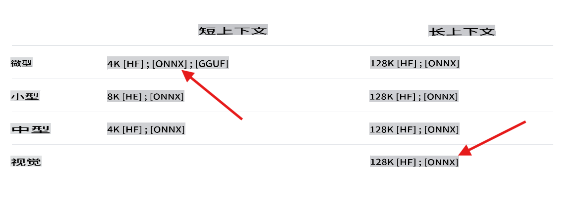

## 欢迎来到使用 C# 的 Phi-3 实验室

这里有一系列实验室展示了如何在 .NET 环境中集成强大的不同版本的 Phi-3 模型。

## 先决条件
在运行示例之前，请确保您已安装以下内容：

**.NET 8:** 确保您的机器上已安装[最新版本的 .NET](https://dotnet.microsoft.com/download/dotnet/8.0?WT.mc_id=aiml-137032-kinfeylo)。

**（可选）Visual Studio 或 Visual Studio Code:** 您需要一个能够运行 .NET 项目的 IDE 或代码编辑器。推荐使用 [Visual Studio](https://visualstudio.microsoft.com/) 或 [Visual Studio Code](https://code.visualstudio.com?WT.mc_id=aiml-137032-kinfeylo)。

**使用 git** 从 [Hugging Face](https://huggingface.co) 本地克隆一个可用的 Phi-3 版本。

**下载 phi3-mini-4k-instruct-onnx 模型**到您的本地机器：

### 导航到存储模型的文件夹
```bash
cd c:\phi3\models
```
### 添加 lfs 支持
```bash
git lfs install 
```
### 克隆并下载 mini 4K instruct 模型
```bash
git clone https://huggingface.co/microsoft/Phi-3-mini-4k-instruct-onnx
```

### 克隆并下载 vision 128K 模型
```
git clone https://huggingface.co/microsoft/Phi-3-vision-128k-instruct-onnx-cpu
```
**重要:** 当前的演示是设计用于模型的 ONNX 版本。上述步骤会克隆以下模型。



## 关于实验室

主要的解决方案包含几个示例实验室，展示了使用 C# 的 Phi-3 模型的能力。

| 项目 | 描述 | 位置 |
| ------------ | ----------- | -------- |
| LabsPhi301    | 这是一个示例项目，使用本地 phi3 模型来提问。项目加载一个本地 ONNX Phi-3 模型，使用 `Microsoft.ML.OnnxRuntime` libraries. | .\src\LabsPhi301\ |
| LabsPhi302    | This is a sample project that implement a Console chat using Semantic Kernel. | .\src\LabsPhi302\ |
| LabsPhi303 | This is a sample project that uses a local phi3 vision model to analyze images.. The project load a local ONNX Phi-3 Vision model using the `Microsoft.ML.OnnxRuntime` libraries. | .\src\LabsPhi303\ |
| LabsPhi304 | This is a sample project that uses a local phi3 vision model to analyze images.. The project load a local ONNX Phi-3 Vision model using the `Microsoft.ML.OnnxRuntime` libraries. The project also presents a menu with different options to interacti with the user. | .\src\LabsPhi304\ |
| LabsPhi305 | This is a sample project that uses a the Phi-3 hosted in ollama model to answer a question.  |**coming soon**|
| LabsPhi306 | This is a sample project that implement a Console chat using Semantic Kernel. |**coming soon**|
| LabsPhi307  | This is a sample project that implement a RAG using local embeddings and Semantic Kernel. |**coming soon**|


## How to Run the Projects

To run the projects, follow these steps:
1. Clone the repository to your local machine.

1. Open a terminal and navigate to the desired project. In example, let's run `LabsPhi301`。
    ```bash
    cd .\src\LabsPhi301\
    ```

1. 使用以下命令运行项目
    ```bash
    dotnet run
    ```

1. 示例项目会要求用户输入，并使用本地模式回复。

    运行中的演示类似于这个：

    

    ***注意:** 第一个问题有一个拼写错误，Phi-3 足够聪明，能够分享正确答案！*

1. 项目 `LabsPhi304` 要求用户选择不同的选项，然后处理请求。例如，分析本地图像。

    运行中的演示类似于这个：

    

**免责声明**：
本文档使用基于机器的人工智能翻译服务进行翻译。尽管我们力求准确，但请注意，自动翻译可能包含错误或不准确之处。应将原始语言的文档视为权威来源。对于关键信息，建议进行专业人工翻译。对于因使用此翻译而产生的任何误解或误读，我们不承担任何责任。