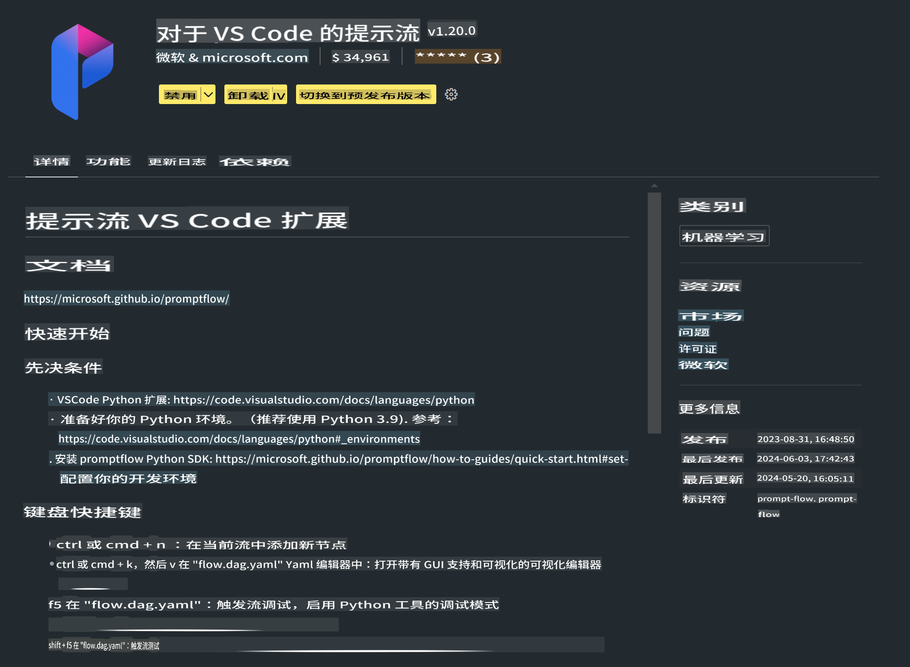

# **实验 0 - 安装**

当我们进入实验室时，我们需要配置相关的环境：

### **1. Python 3.11+**

推荐使用 miniforge 来配置你的 Python 环境

要配置 miniforge，请参考 [https://github.com/conda-forge/miniforge](https://github.com/conda-forge/miniforge)

配置 miniforge 后，在 Power Shell 中运行以下命令

```bash

conda create -n pyenv python==3.11.8 -y

conda activate pyenv

```

### **2. 安装 Prompt flow SDK**

在实验 1 中，我们会使用 Prompt flow，所以你需要配置 Prompt flow SDK。

```bash

pip install promptflow --upgrade

```

你可以通过以下命令检查 promptflow sdk

```bash

pf --version

```

### **3. 安装 Visual Studio Code Prompt flow 扩展**



### **4. Intel NPU 加速库**

Intel 的新一代处理器支持 NPU。如果你想在本地使用 NPU 来运行 LLMs / SLMs，你可以使用 ***Intel NPU 加速库***。如果你想了解更多，可以阅读 [https://github.com/microsoft/Phi-3CookBook/blob/main/md/03.Inference/AIPC_Inference.md](https://github.com/microsoft/Phi-3CookBook/blob/main/md/03.Inference/AIPC_Inference.md)。

在 bash 中安装 Intel NPU 加速库

```bash

pip install intel-npu-acceleration-library

```

***注意***: 请注意这个库支持 transformers ***4.40.2***，请确认版本

### **5. 其他 Python 库**

创建 requirements.txt 并添加以下内容

```txt

notebook
numpy 
scipy 
scikit-learn 
matplotlib 
pandas 
pillow 
graphviz

```

### **6. 安装 NVM**

在 Powershell 中安装 nvm

```bash

winget install -e --id CoreyButler.NVMforWindows

```

安装 nodejs 18.20

```bash

nvm install 18.20.0

nvm use 18.20.0

```

### **7. 安装 Visual Studio Code 开发支持**

```bash

npm install --global yo generator-code

```

恭喜你！你已经成功配置了 SDK。接下来，进行实际操作步骤。

**免责声明**：
本文件使用基于机器的人工智能翻译服务进行翻译。虽然我们力求准确，但请注意，自动翻译可能包含错误或不准确之处。应将原始语言的文件视为权威来源。对于关键信息，建议进行专业的人类翻译。对于因使用本翻译而产生的任何误解或误读，我们概不负责。