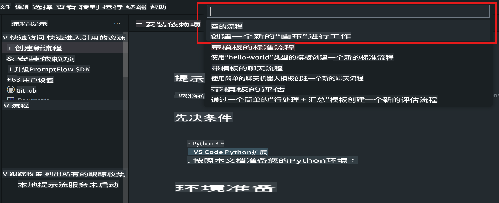
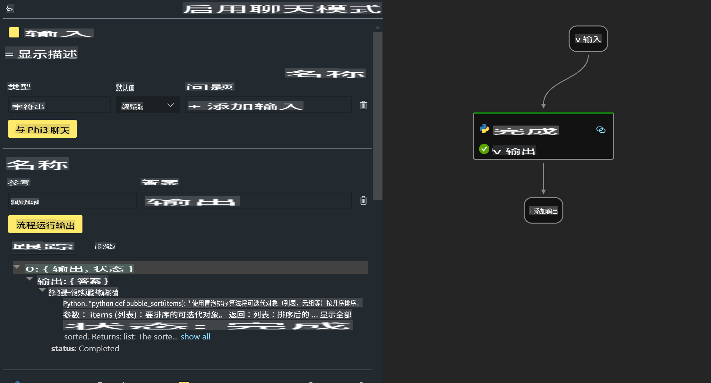
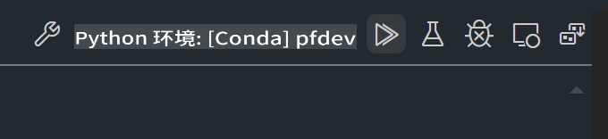

# **实验 2 - 在 AIPC 中运行 Phi-3-mini 的 Prompt flow**

## **什么是 Prompt flow**

Prompt flow 是一套开发工具，旨在简化基于 LLM 的 AI 应用程序的端到端开发周期，从构思、原型设计、测试、评估到生产部署和监控。它使得提示工程变得更加容易，并使您能够构建具有生产质量的 LLM 应用程序。

使用 Prompt flow，您将能够：

- 创建将 LLMs、提示、Python 代码和其他工具连接在一起的可执行工作流。

- 调试和迭代您的工作流，特别是与 LLMs 的交互。

- 评估您的工作流，使用更大的数据集计算质量和性能指标。

- 将测试和评估集成到您的 CI/CD 系统中，以确保工作流的质量。

- 将您的工作流部署到您选择的服务平台，或轻松集成到您的应用程序代码库中。

- （可选但强烈推荐）通过利用 Azure AI 上的云版本 Prompt flow 与您的团队协作。


## **在 Apple Silicon 上构建生成代码工作流**

***注意***：如果您尚未完成环境安装，请访问 [Lab 0 - 安装](./01.Installations.md)

1. 在 Visual Studio Code 中打开 Prompt flow 扩展并创建一个空的工作流项目



2. 添加输入和输出参数，并添加 Python 代码作为新的工作流



您可以参考此结构（flow.dag.yaml）构建您的工作流

```yaml

inputs:
  prompt:
    type: string
    default: Write python code for Fibonacci serie. Please use markdown as output
outputs:
  result:
    type: string
    reference: ${gen_code_by_phi3.output}
nodes:
- name: gen_code_by_phi3
  type: python
  source:
    type: code
    path: gen_code_by_phi3.py
  inputs:
    prompt: ${inputs.prompt}


```

3. 量化 phi-3-mini

我们希望在本地设备上更好地运行 SLM。通常，我们会量化模型（INT4，FP16，FP32）

```bash

python -m mlx_lm.convert --hf-path microsoft/Phi-3-mini-4k-instruct

```

**注意：** 默认文件夹是 mlx_model 

4. 在 ***Chat_With_Phi3.py*** 中添加代码

```python


from promptflow import tool

from mlx_lm import load, generate


# The inputs section will change based on the arguments of the tool function, after you save the code
# Adding type to arguments and return value will help the system show the types properly
# Please update the function name/signature per need
@tool
def my_python_tool(prompt: str) -> str:

    model_id = './mlx_model_phi3_mini'

    model, tokenizer = load(model_id)

    # <|user|>\nWrite python code for Fibonacci serie. Please use markdown as output<|end|>\n<|assistant|>

    response = generate(model, tokenizer, prompt="<|user|>\n" + prompt  + "<|end|>\n<|assistant|>", max_tokens=2048, verbose=True)

    return response


```

4. 您可以通过调试或运行来测试工作流，以检查生成代码是否正常



5. 在终端中作为开发 API 运行工作流

```

pf flow serve --source ./ --port 8080 --host localhost   

```

您可以在 Postman / Thunder Client 中测试它


### **注意**

1. 第一次运行需要很长时间。建议从 Hugging face CLI 下载 phi-3 模型。

2. 考虑到 Intel NPU 的计算能力有限，建议使用 Phi-3-mini-4k-instruct

3. 我们使用 Intel NPU 加速进行 INT4 转换量化，但如果重新运行服务，需要删除缓存和 nc_workshop 文件夹。


## **资源**

1. 学习 Promptflow [https://microsoft.github.io/promptflow/](https://microsoft.github.io/promptflow/)

2. 学习 Intel NPU 加速 [https://github.com/intel/intel-npu-acceleration-library](https://github.com/intel/intel-npu-acceleration-library)

3. 示例代码，下载 [本地 NPU 代理示例代码](../../../../../../../code/07.Lab/01/AIPC/local-npu-agent)

**免责声明**:
本文件使用基于机器的人工智能翻译服务进行翻译。尽管我们努力确保准确性，但请注意，自动翻译可能包含错误或不准确之处。应将原始语言的文件视为权威来源。对于关键信息，建议使用专业人工翻译。对于因使用此翻译而引起的任何误解或误读，我们不承担责任。