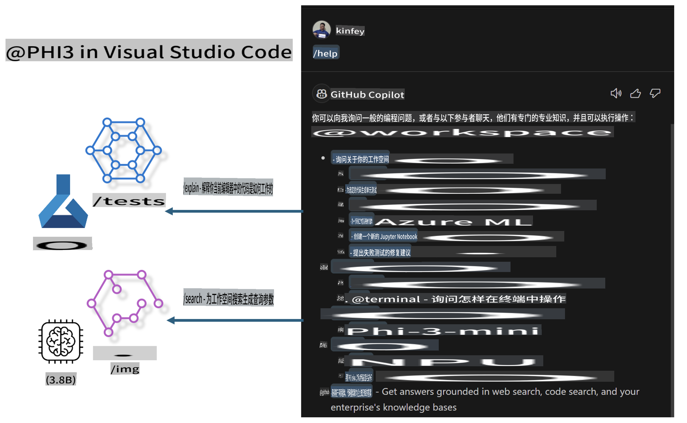

# **构建你自己的 Visual Studio Code GitHub Copilot Chat 与 Microsoft Phi-3 系列**

你是否使用过 GitHub Copilot Chat 中的工作区代理？你想构建自己的团队代码代理吗？这个实践实验室希望结合开源模型来构建企业级代码业务代理。

## **基础**

### **为什么选择 Microsoft Phi-3**

Phi-3 是一个家族系列，包括 phi-3-mini、phi-3-small 和 phi-3-medium，基于不同的训练参数用于文本生成、对话完成和代码生成。还有基于视觉的 phi-3-vision。它适合企业或不同团队创建离线生成式 AI 解决方案。

推荐阅读此链接 [https://github.com/microsoft/Phi-3CookBook/blob/main/md/01.Introduce/Phi3Family.md](https://github.com/microsoft/Phi-3CookBook/blob/main/md/01.Introduce/Phi3Family.md)

### **Microsoft GitHub Copilot Chat**

GitHub Copilot Chat 扩展为你提供了一个聊天界面，让你可以与 GitHub Copilot 互动，并直接在 VS Code 中收到与编码相关问题的答案，而无需导航文档或在线搜索论坛。

Copilot Chat 可能使用语法高亮、缩进和其他格式化功能来增加生成响应的清晰度。根据用户提问的类型，结果可能包含 Copilot 用于生成响应的上下文链接，例如源代码文件或文档，或者访问 VS Code 功能的按钮。

- Copilot Chat 集成在你的开发流程中，并在你需要的地方提供帮助：

- 直接从编辑器或终端启动内联聊天对话，以便在编码时获得帮助

- 使用聊天视图，在一旁拥有一个 AI 助手，随时提供帮助

- 启动快速聊天，问一个快速问题，然后回到你正在做的事情

你可以在各种场景中使用 GitHub Copilot Chat，例如：

- 回答如何最好地解决问题的编码问题

- 解释别人的代码并提出改进建议

- 提出代码修复建议

- 生成单元测试用例

- 生成代码文档

推荐阅读此链接 [https://code.visualstudio.com/docs/copilot/copilot-chat](https://code.visualstudio.com/docs/copilot/copilot-chat?WT.mc_id=aiml-137032-kinfeylo)

###  **Microsoft GitHub Copilot Chat @workspace**

在 Copilot Chat 中引用 **@workspace** 让你可以询问关于整个代码库的问题。根据问题，Copilot 智能地检索相关文件和符号，然后在回答中作为链接和代码示例引用它们。

为了回答你的问题，**@workspace** 会搜索开发者在 VS Code 中导航代码库时会使用的相同来源：

- 工作区中的所有文件，除了被 .gitignore 文件忽略的文件

- 带有嵌套文件夹和文件名的目录结构

- GitHub 的代码搜索索引，如果工作区是一个 GitHub 仓库并且被代码搜索索引

- 工作区中的符号和定义

- 当前选定的文本或活动编辑器中可见的文本

注意：如果你打开了一个文件或在一个被忽略的文件中选中了文本，.gitignore 会被绕过。

推荐阅读此链接 [https://code.visualstudio.com/docs/copilot/copilot-chat](https://code.visualstudio.com/docs/copilot/workspace-context?WT.mc_id=aiml-137032-kinfeylo)

## **了解更多关于本实验室的信息**

GitHub Copilot 大大提高了企业的编程效率，每个企业都希望定制 GitHub Copilot 的相关功能。许多企业基于自己的业务场景和开源模型定制了类似 GitHub Copilot 的扩展。对于企业来说，定制的扩展更容易控制，但这也会影响用户体验。毕竟，GitHub Copilot 在处理一般场景和专业性方面功能更强。如果能保持一致的体验，同时定制企业自己的扩展，那将是更好的用户体验。GitHub Copilot Chat 为企业提供了相关的 API 以扩展聊天体验。保持一致的体验并拥有定制功能是更好的用户体验。

本实验室主要使用 Phi-3 模型结合本地 NPU 和 Azure 混合来构建 GitHub Copilot Chat 中的自定义代理 ***@PHI3***，以协助企业开发人员完成代码生成***(@PHI3 /gen)***以及基于图像生成代码***(@PHI3 /img)***。

### ***注意：***

本实验室目前在 Intel CPU 和 Apple Silicon 的 AIPC 上实现。我们将继续更新 Qualcomm 版本的 NPU。

## **实验室**

| 名称 | 描述 | AIPC | Apple |
| ------------ | ----------- | -------- |-------- |
| Lab0 - 安装(✅) | 配置和安装相关环境和安装工具 | [Go](./HOL/AIPC/01.Installations.md) |[Go](./HOL/Apple/01.Installations.md) |
| Lab1 - 使用 Phi-3-mini 运行 Prompt flow (✅) | 结合 AIPC / Apple Silicon，使用本地 NPU 通过 Phi-3-mini 创建代码生成 | [Go](./HOL/AIPC/02.PromptflowWithNPU.md) |  [Go](./HOL/Apple/02.PromptflowWithMLX.md) |
| Lab2 - 在 Azure 机器学习服务上部署 Phi-3-vision (✅) | 通过部署 Azure 机器学习服务的模型目录 - Phi-3-vision 图像生成代码 | [Go](./HOL/AIPC/03.DeployPhi3VisionOnAzure.md) |[Go](./HOL/Apple/03.DeployPhi3VisionOnAzure.md) |
| Lab3 - 在 GitHub Copilot Chat 中创建 @phi-3 代理(✅)  | 在 GitHub Copilot Chat 中创建自定义 Phi-3 代理，以完成代码生成、图生成代码、RAG 等 | [Go](./HOL/AIPC/04.CreatePhi3AgentInVSCode.md) | [Go](./HOL/Apple/04.CreatePhi3AgentInVSCode.md) |
| 示例代码 (✅)  | 下载示例代码 | [Go](../../../../../code/07.Lab/01/AIPC) | [Go](../../../../../code/07.Lab/01/Apple) |

## **资源**

1. Phi-3 Cookbook [https://github.com/microsoft/Phi-3CookBook](https://github.com/microsoft/Phi-3CookBook)

2. 了解更多关于 GitHub Copilot 的信息 [https://learn.microsoft.com/training/paths/copilot/](https://learn.microsoft.com/training/paths/copilot/?WT.mc_id=aiml-137032-kinfeylo)

3. 了解更多关于 GitHub Copilot Chat 的信息 [https://learn.microsoft.com/training/paths/accelerate-app-development-using-github-copilot/](https://learn.microsoft.com/training/paths/accelerate-app-development-using-github-copilot/?WT.mc_id=aiml-137032-kinfeylo)

4. 了解更多关于 GitHub Copilot Chat API 的信息 [https://code.visualstudio.com/api/extension-guides/chat](https://code.visualstudio.com/api/extension-guides/chat?WT.mc_id=aiml-137032-kinfeylo)

5. 了解更多关于 Azure AI Foundry 的信息 [https://learn.microsoft.com/training/paths/create-custom-copilots-ai-studio/](https://learn.microsoft.com/training/paths/create-custom-copilots-ai-studio/?WT.mc_id=aiml-137032-kinfeylo)

6. 了解更多关于 Azure AI Foundry 的模型目录的信息 [https://learn.microsoft.com/azure/ai-studio/how-to/model-catalog-overview](https://learn.microsoft.com/azure/ai-studio/how-to/model-catalog-overview)

**免责声明**:
本文档已使用基于机器的人工智能翻译服务进行翻译。尽管我们努力确保准确性，但请注意，自动翻译可能包含错误或不准确之处。应将原文档的本地语言版本视为权威来源。对于关键信息，建议进行专业的人类翻译。我们对使用此翻译所引起的任何误解或误读不承担责任。