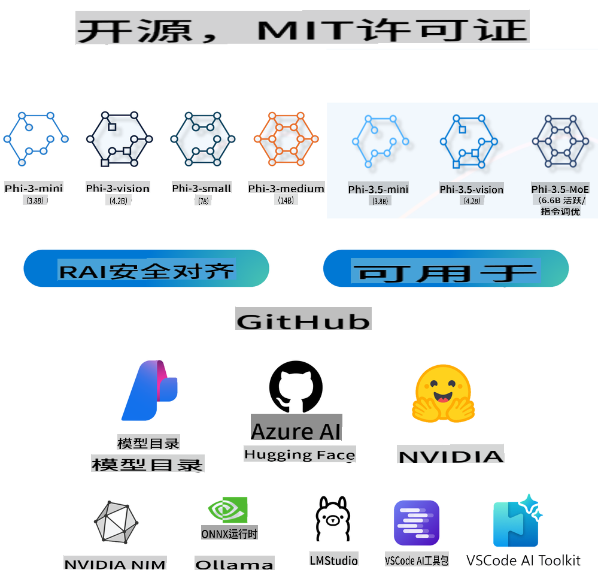
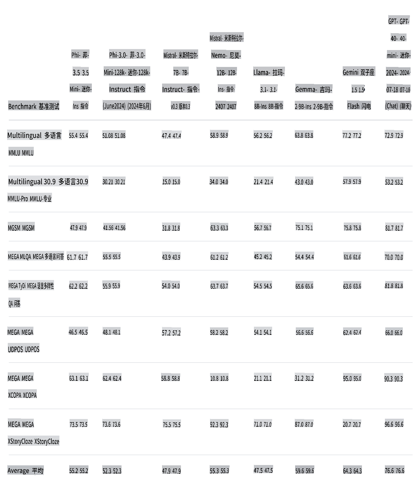
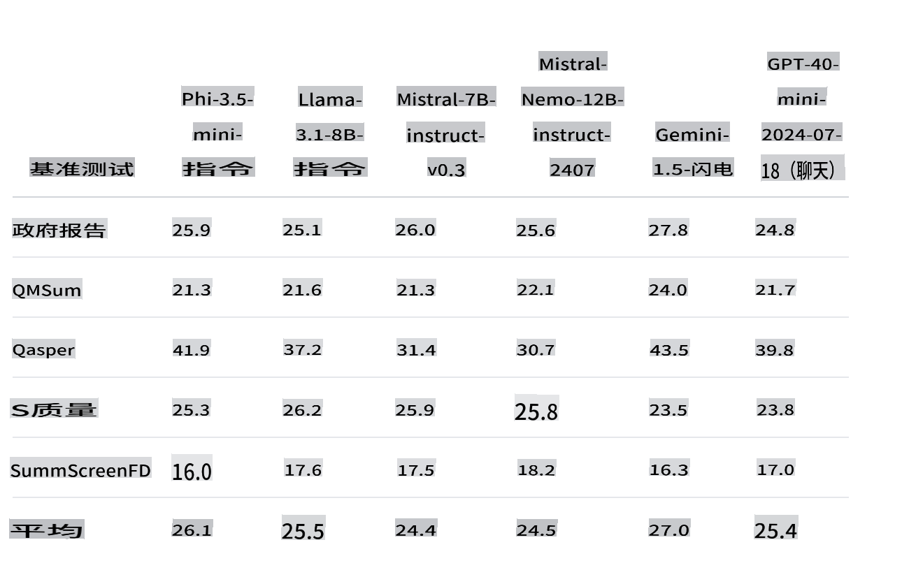
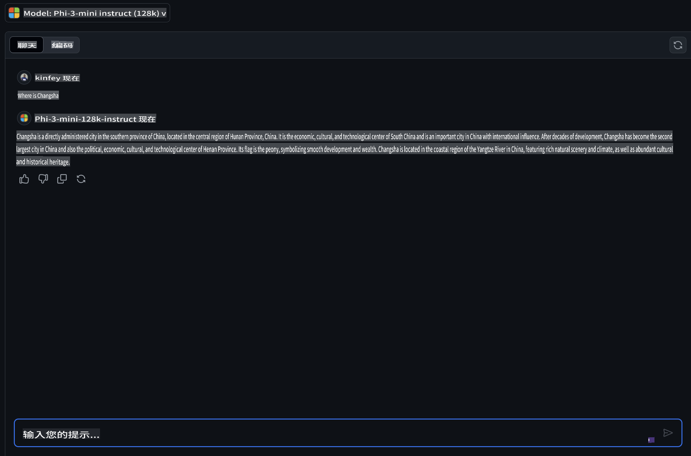
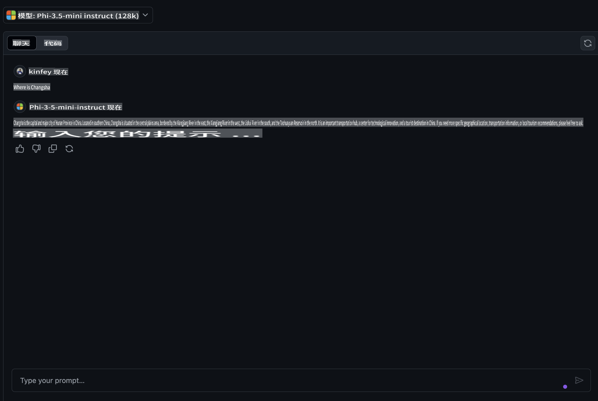
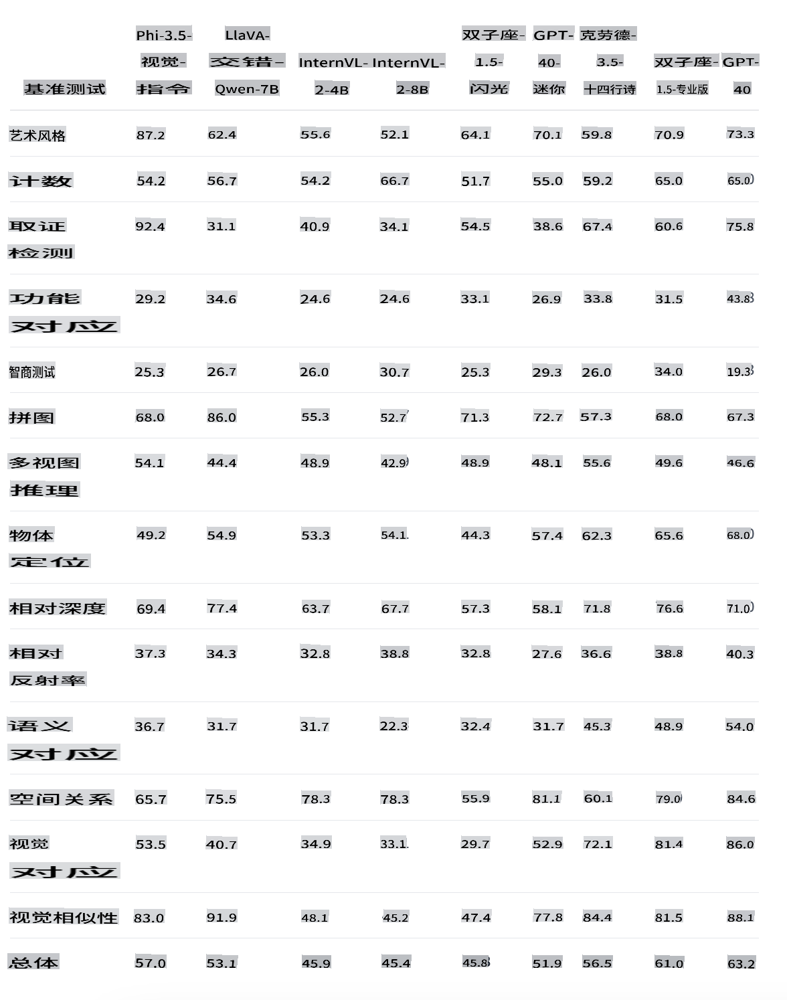
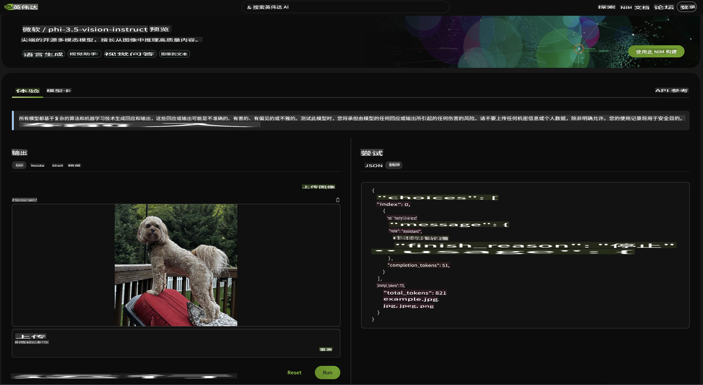
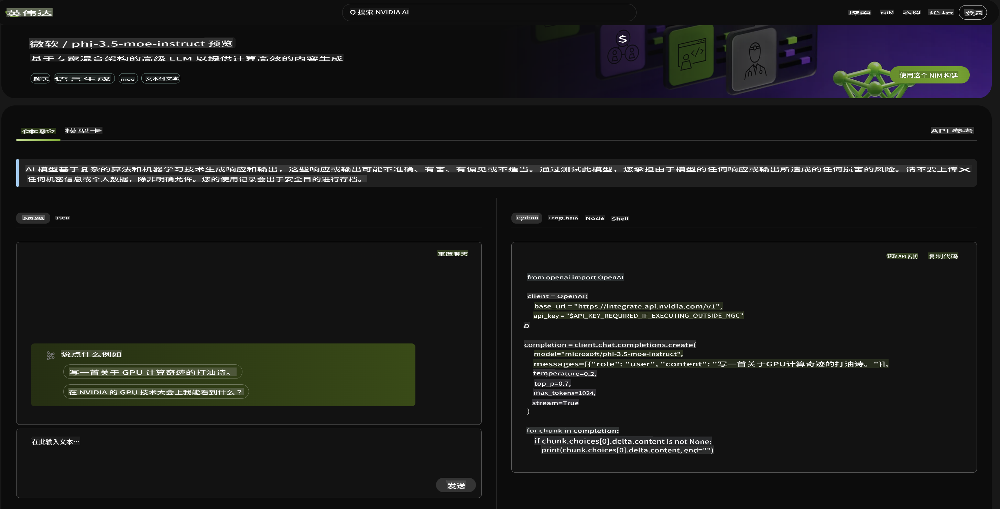

# **Phi-3.5 家族的最新动态**

你已经在使用 Phi-3 家族了吗？你的使用场景是什么？2024年8月20日，微软发布了全新的 Phi-3.5 家族，在多语言、视觉和 AI Agent 方面进行了增强。让我们结合 Hugging face 上的模型卡片做一个更详细的介绍。

## **Phi-3.5-mini-instruct**

Phi-3.5-mini 是一个轻量级、最先进的开放模型，基于用于 Phi-3 的数据集构建——合成数据和经过筛选的公开网站数据，专注于高质量、逻辑密集的数据。该模型属于 Phi-3 模型家族，支持 128K 令牌上下文长度。模型经过严格的增强过程，结合了监督微调、近端策略优化和直接偏好优化，以确保精确的指令遵循和强大的安全措施。

通过 Benchmark 上的指标可以看出，Phi-3.5-mini 相比 Phi-3-mini 增强了对多语言和长文本内容的支持，这在边缘应用中增强了 Phi-3.5 mini 的语言和文本能力。

我们可以通过 GitHub Models 比较中文知识的能力。当我们问“长沙在哪里？”时，可以比较 Phi-3-mini-128k-instruct 和 Phi-3.5-mini-128k-instruct 的结果。

不难看出，在中文语料库上的数据增强使得 Phi-3.5-mini 在基本文本生成场景中有更好的结果（***注意：*** 请注意，如果 Phi-3.5-mini 需要更准确的答案，建议根据应用场景进行微调）

## **Phi-3.5-vision-instruct**

Phi-3.5-vision 是一个轻量级、最先进的开放多模态模型，基于包括合成数据和经过筛选的公开网站数据在内的数据集构建，专注于高质量、逻辑密集的数据，无论是文本还是视觉。该模型属于 Phi-3 模型家族，多模态版本支持 128K 上下文长度（以令牌计）。模型经过严格的增强过程，结合了监督微调和直接偏好优化，以确保精确的指令遵循和强大的安全措施。

通过 Vision 我们让 Phi-3.x 家族睁开了眼睛，能够完成以下场景：

1. 内存/计算受限的环境
2. 延迟受限的场景
3. 一般图像理解
4. 光学字符识别
5. 图表和表格理解
6. 多图像比较
7. 多图像或视频剪辑总结

通过 Vision，我们让 Phi 家族睁开眼睛，完成以下场景。

我们还可以使用提供的 Hugging face benchmark 了解在不同视觉场景下的比较。

如果你想试用 Phi-3.5-vision-instruct 的免费试用版，我们可以使用 [Nivida NIM](https://build.nvidia.com/microsoft/phi-3_5-vision-instruct) 完成体验。

当然，你也可以通过 Azure AI Foundry 完成部署。

## **Phi-3.5-MoE-instruct**

Phi-3.5-MoE 是一个轻量级、最先进的开放模型，基于用于 Phi-3 的数据集构建——合成数据和经过筛选的公开文档，专注于高质量、逻辑密集的数据。该模型支持多语言，并支持 128K 上下文长度（以令牌计）。模型经过严格的增强过程，结合了监督微调、近端策略优化和直接偏好优化，以确保精确的指令遵循和强大的安全措施。

随着 AI Agent 的发展，对 MoE 模型的需求将逐渐增加。MoE，全称为混合专家模型，是由多个专家模型混合形成的新模型。MoE 是先将大问题拆分，再逐个解决小问题，然后总结结论。其次，模型规模是提高模型性能的关键因素之一。在有限的计算资源下，使用较少的训练步骤训练更大的模型通常比使用更多步骤训练较小的模型更好。

Phi-3.5-MoE-Instruct 模型需要比 Phi-3.5-Vision 和 Phi-3.5-Instruct 更多的计算能力。建议使用 Azure AI Foundry 和 Nvidia NIM 等基于云的方法进行体验和使用。

### **🤖 Phi-3.5 与 Apple MLX 的示例**

| 实验室    | 介绍 | 前往 |
| -------- | ------- |  ------- |
| 🚀 实验室-介绍 Phi-3.5 Instruct  | 学习如何使用 Phi-3.5 Instruct |  [前往](../../../../../code/09.UpdateSamples/Aug/phi3-instruct-demo.ipynb)    |
| 🚀 实验室-介绍 Phi-3.5 Vision（图像） | 学习如何使用 Phi-3.5 Vision 分析图像 |  [前往](../../../../../code/09.UpdateSamples/Aug/phi3-vision-demo.ipynb)    |
| 🚀 实验室-介绍 Phi-3.5 MoE   | 学习如何使用 Phi-3.5 Vision 分析图像 |  [前往](../../../../../code/09.UpdateSamples/Aug/phi3_moe_demo.ipynb)    |

## **资源**

1. Hugging face 的 Phi 家族 [https://huggingface.co/collections/microsoft/phi-3-6626e15e9585a200d2d761e3](https://huggingface.co/collections/microsoft/phi-3-6626e15e9585a200d2d761e3)

2. 关于 GitHub Models [https://gh.io/models](https://gh.io/models)

3. 关于 Azure AI Foundry [https://ai.azure.com/](https://ai.azure.com/)

4. 关于 Nividia NIM [https://build.nvidia.com/explore/discover](https://build.nvidia.com/explore/discover)

**免责声明**：
本文档使用基于机器的人工智能翻译服务进行翻译。虽然我们努力确保准确性，但请注意，自动翻译可能包含错误或不准确之处。应将原文档的母语版本视为权威来源。对于关键信息，建议使用专业人工翻译。我们对使用此翻译所引起的任何误解或误读不承担责任。