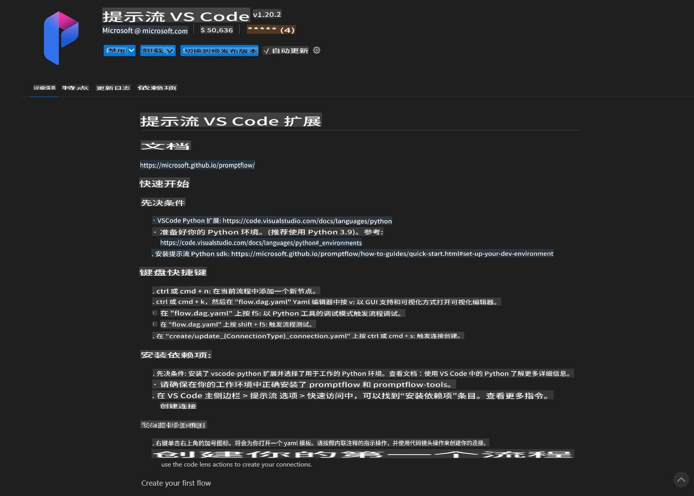
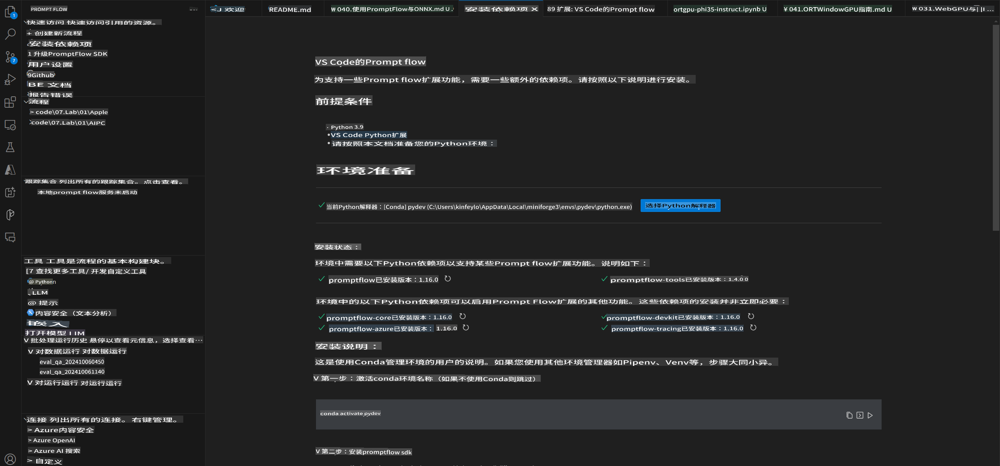
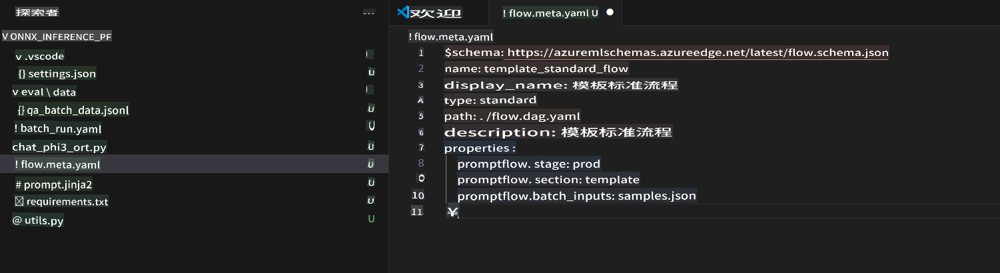
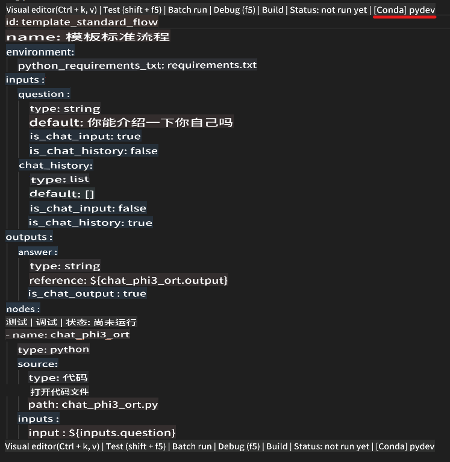
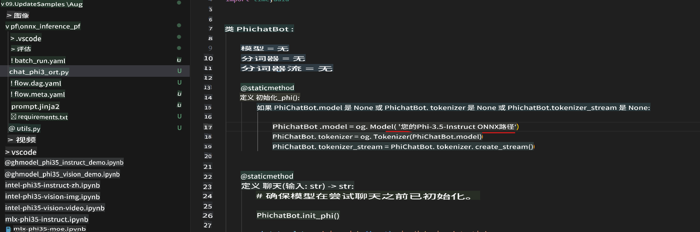
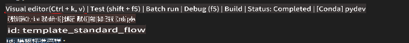
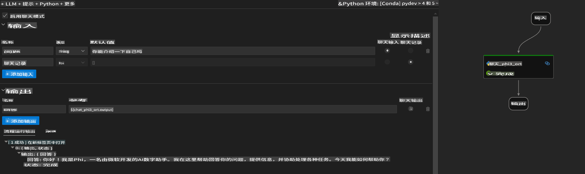
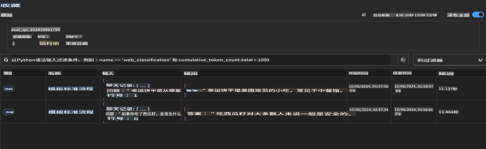

# 使用 Windows GPU 创建基于 Phi-3.5-Instruct ONNX 的 Prompt flow 解决方案

以下文档是一个如何使用 PromptFlow 和 ONNX（开放神经网络交换）来开发基于 Phi-3 模型的 AI 应用程序的示例。

PromptFlow 是一套开发工具，旨在简化基于 LLM（大型语言模型）的 AI 应用程序从构思、原型设计到测试和评估的整个开发周期。

通过将 PromptFlow 与 ONNX 集成，开发人员可以：

- 优化模型性能：利用 ONNX 进行高效的模型推理和部署。
- 简化开发：使用 PromptFlow 管理工作流程并自动化重复任务。
- 增强协作：通过提供统一的开发环境，促进团队成员之间的更好协作。

**Prompt flow** 是一套开发工具，旨在简化基于 LLM 的 AI 应用程序从构思、原型设计、测试、评估到生产部署和监控的整个开发周期。它使提示工程变得更加容易，并使您能够构建具有生产质量的 LLM 应用程序。

Prompt flow 可以连接到 OpenAI、Azure OpenAI 服务和可定制的模型（如 Huggingface、本地 LLM/SLM）。我们希望将 Phi-3.5 的量化 ONNX 模型部署到本地应用程序中。Prompt flow 可以帮助我们更好地规划业务并完成基于 Phi-3.5 的本地解决方案。在这个示例中，我们将结合 ONNX Runtime GenAI 库完成基于 Windows GPU 的 Prompt flow 解决方案。

## **安装**

### **Windows GPU 的 ONNX Runtime GenAI**

阅读此指南以设置 Windows GPU 的 ONNX Runtime GenAI [点击这里](./041.ORTWindowGPUGuideline.md)

### **在 VSCode 中设置 Prompt flow**

1. 安装 Prompt flow VS Code 扩展



2. 安装 Prompt flow VS Code 扩展后，点击扩展，并选择 **安装依赖项**，按照此指南在您的环境中安装 Prompt flow SDK



3. 下载 [示例代码](../../../../../code/09.UpdateSamples/Aug/pf/onnx_inference_pf) 并使用 VS Code 打开此示例



4. 打开 **flow.dag.yaml** 选择您的 Python 环境



   打开 **chat_phi3_ort.py** 更改您的 Phi-3.5-instruct ONNX 模型位置



5. 运行您的 Prompt flow 进行测试

打开 **flow.dag.yaml** 点击可视化编辑器



点击此处并运行它进行测试



6. 您可以在终端中运行批处理以检查更多结果

```bash

pf run create --file batch_run.yaml --stream --name 'Your eval qa name'    

```

您可以在默认浏览器中查看结果



**免责声明**：
本文档使用基于机器的人工智能翻译服务进行翻译。尽管我们力求准确，但请注意，自动翻译可能包含错误或不准确之处。应将原始语言的文档视为权威来源。对于关键信息，建议使用专业人工翻译。对于因使用本翻译而引起的任何误解或误读，我们不承担责任。