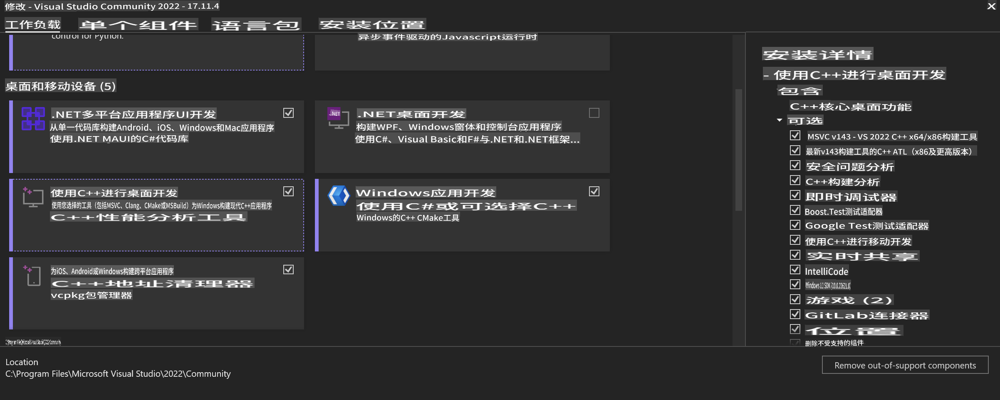
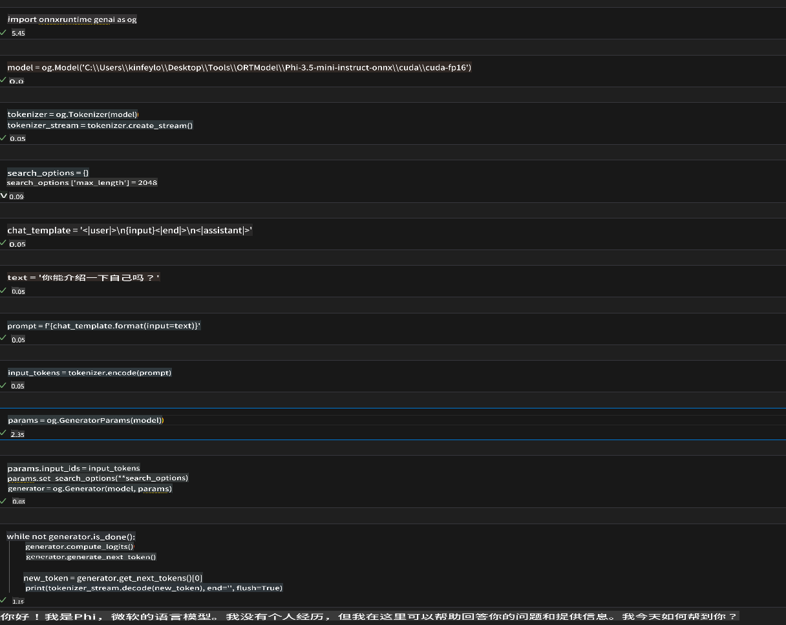
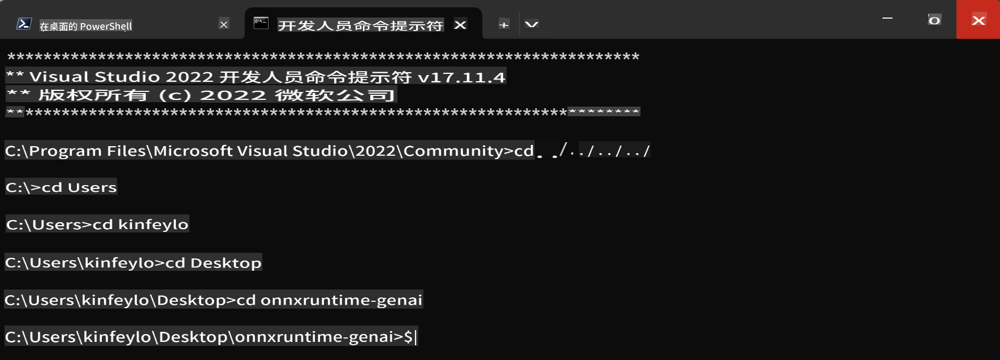

# **OnnxRuntime GenAI Windows GPU 指南**

本指南提供了在 Windows 上使用 GPU 设置和使用 ONNX Runtime (ORT) 的步骤。旨在帮助您利用 GPU 加速您的模型，提高性能和效率。

本文档提供了以下指导：

- 环境设置：安装必要的依赖项，如 CUDA、cuDNN 和 ONNX Runtime 的说明。
- 配置：如何配置环境和 ONNX Runtime 以有效利用 GPU 资源。
- 优化技巧：如何微调您的 GPU 设置以获得最佳性能的建议。

### **1. Python 3.10.x /3.11.8**

   ***Note*** 建议使用 [miniforge](https://github.com/conda-forge/miniforge/releases/latest/download/Miniforge3-Windows-x86_64.exe) 作为您的 Python 环境

   ```bash

   conda create -n pydev python==3.11.8

   conda activate pydev

   ```

   ***Reminder*** 如果您已安装任何与 python ONNX 相关的库，请卸载它

### **2. 使用 winget 安装 CMake**

   ```bash

   winget install -e --id Kitware.CMake

   ```

### **3. 安装 Visual Studio 2022 - 桌面开发与 C++**

   ***Note*** 如果您不想编译，可以跳过此步骤



### **4. 安装 NVIDIA 驱动程序**

1. **NVIDIA GPU 驱动程序**  [https://www.nvidia.com/en-us/drivers/](https://www.nvidia.com/en-us/drivers/)

2. **NVIDIA CUDA 12.4** [https://developer.nvidia.com/cuda-12-4-0-download-archive](https://developer.nvidia.com/cuda-12-4-0-download-archive)

3. **NVIDIA CUDNN 9.4**  [https://developer.nvidia.com/cudnn-downloads](https://developer.nvidia.com/cudnn-downloads)

***Reminder*** 请使用默认设置进行安装

### **5. 设置 NVIDIA 环境**

将 NVIDIA CUDNN 9.4 的 lib、bin、include 复制到 NVIDIA CUDA 12.4 的 lib、bin、include

- 将 *'C:\Program Files\NVIDIA\CUDNN\v9.4\bin\12.6'* 文件复制到 *'C:\Program Files\NVIDIA GPU Computing Toolkit\CUDA\v12.4\bin*

- 将 *'C:\Program Files\NVIDIA\CUDNN\v9.4\include\12.6'* 文件复制到 *'C:\Program Files\NVIDIA GPU Computing Toolkit\CUDA\v12.4\include*

- 将 *'C:\Program Files\NVIDIA\CUDNN\v9.4\lib\12.6'* 文件复制到 *'C:\Program Files\NVIDIA GPU Computing Toolkit\CUDA\v12.4\lib\x64'*

### **6. 下载 Phi-3.5-mini-instruct-onnx**

   ```bash

   winget install -e --id Git.Git

   winget install -e --id GitHub.GitLFS

   git lfs install

   git clone https://huggingface.co/microsoft/Phi-3.5-mini-instruct-onnx

   ```

### **7. 运行 InferencePhi35Instruct.ipynb**

   打开 [Notebook](../../../../../code/09.UpdateSamples/Aug/ortgpu-phi35-instruct.ipynb) 并执行



### **8. 编译 ORT GenAI GPU**

   ***Note*** 
   
   1. 请首先卸载所有关于 onnx、onnxruntime 和 onnxruntime-genai 的内容

   ```bash

   pip list 
   
   ```

   然后卸载所有 onnxruntime 库，例如

   ```bash

   pip uninstall onnxruntime

   pip uninstall onnxruntime-genai

   pip uninstall onnxruntume-genai-cuda
   
   ```

   2. 检查 Visual Studio 扩展支持 

   检查 C:\Program Files\NVIDIA GPU Computing Toolkit\CUDA\v12.4\extras 确保找到 C:\Program Files\NVIDIA GPU Computing Toolkit\CUDA\v12.4\extras\visual_studio_integration。 
   
   如果没有找到，请检查其他 CUDA 工具包驱动程序文件夹并将 visual_studio_integration 文件夹及其内容复制到 C:\Program Files\NVIDIA GPU Computing Toolkit\CUDA\v12.4\extras\visual_studio_integration

   - 如果您不想编译，可以跳过此步骤

   ```bash

   git clone https://github.com/microsoft/onnxruntime-genai

   ```

   - 下载 [https://github.com/microsoft/onnxruntime/releases/download/v1.19.2/onnxruntime-win-x64-gpu-1.19.2.zip](https://github.com/microsoft/onnxruntime/releases/download/v1.19.2/onnxruntime-win-x64-gpu-1.19.2.zip)

   - 解压 onnxruntime-win-x64-gpu-1.19.2.zip，并将其重命名为 **ort**，将 ort 文件夹复制到 onnxruntime-genai

   - 使用 Windows Terminal，进入 VS 2022 的开发者命令提示符并进入 onnxruntime-genai 



   - 使用您的 python 环境编译

   ```bash

   cd onnxruntime-genai

   python build.py --use_cuda  --cuda_home "C:\Program Files\NVIDIA GPU Computing Toolkit\CUDA\v12.4" --config Release
 

   cd build/Windows/Release/Wheel

   pip install .whl

   ```

**免责声明**：
本文档已使用基于机器的AI翻译服务进行翻译。尽管我们努力确保准确性，但请注意，自动翻译可能包含错误或不准确之处。应将原始语言的文档视为权威来源。对于关键信息，建议使用专业的人类翻译。我们不对因使用本翻译而产生的任何误解或误读承担责任。